Module 6 Final Project — Final Report
================
Abby Bridgers and Justin Ehringhaus
Last edited August 15, 2022 at 16:39

-   <a href="#introduction" id="toc-introduction">Introduction</a>
    -   <a href="#overview" id="toc-overview">Overview</a>
    -   <a href="#methods-and-business-questions"
        id="toc-methods-and-business-questions">Methods and Business
        Questions</a>
-   <a href="#data-preparation" id="toc-data-preparation">Data
    Preparation</a>
-   <a href="#exploratory-data-analysis"
    id="toc-exploratory-data-analysis">Exploratory Data Analysis</a>
-   <a href="#predictive-modeling-techniques-and-interpretations"
    id="toc-predictive-modeling-techniques-and-interpretations">Predictive
    Modeling Techniques and Interpretations</a>
    -   <a
        href="#business-question-1-classifying-immigrants-versus-nonimmigrants"
        id="toc-business-question-1-classifying-immigrants-versus-nonimmigrants">Business
        Question #1: Classifying Immigrants versus Nonimmigrants</a>
    -   <a
        href="#business-question-2-predicting-whether-an-individual-views-teaching-tolerance-as-important-based-on-their-beliefs-regarding-immigration"
        id="toc-business-question-2-predicting-whether-an-individual-views-teaching-tolerance-as-important-based-on-their-beliefs-regarding-immigration">Business
        Question #2: Predicting whether an individual views teaching tolerance
        as important based on their beliefs regarding immigration</a>
    -   <a href="#business-question-3-classifying-religious-denominations"
        id="toc-business-question-3-classifying-religious-denominations">Business
        Question #3: Classifying Religious Denominations</a>
    -   <a href="#business-question-4-predicting-confidence-in-elections"
        id="toc-business-question-4-predicting-confidence-in-elections">Business
        Question #4: Predicting Confidence in Elections</a>
-   <a href="#interpretations" id="toc-interpretations">Interpretations</a>
-   <a href="#recommendations--conclusions"
    id="toc-recommendations--conclusions">Recommendations &amp;
    Conclusions</a>
-   <a href="#works-cited" id="toc-works-cited">Works Cited</a>

------------------------------------------------------------------------

``` r
library(pacman)
p_load(tidyverse)  # usual suite of packages
p_load(ggthemes)   # extra themes
p_load(hrbrthemes) # more extra themes
p_load(skimr)      # alternative to summary(), skims dataset: skim()
p_load(VIM)        # visualization of missing values: aggr()
p_load(corrplot)   # visualization of a correlation matrix: corrplot()
p_load(maps)       # world map
p_load(rattle)
p_load(rpart, rpart.plot)
p_load(caret)
```

------------------------------------------------------------------------

## Introduction

##### Overview

The World Values Survey (WVS) aims to understand the values, beliefs,
and norms of people all over the world, comparatively and
longitudinally. Operating in more than 120 countries and conducted every
five years, the WVS uses a common questionnaire and a household
interview format to investigate human beliefs. The data is made
available in waves. Time series data including all waves pooled between
1981-2022 is also available.

While examining the pooled dataset would certainly be interesting to
answer questions about changes in worldwide values, beliefs, and norms,
we are opting to limit the scope of our project to recent years (Wave 7:
2017-2022). Already, the size and scope of this dataset represents a big
step for our group’s budding data analysts, as we have never yet worked
with anything so large and so faceted. The Wave 7 dataset contains 552
variables and 87,822 rows. We have reduced the number of attributes by
about 90%. More details to follow.

##### Methods and Business Questions

Our team is interested in exploring values on religion, immigration,
ethics, and governmental-related topics. We analyze particular subsets
of the dataset using exploratory and predictive techniques suited to the
size, scope, and types of data under consideration. For example, we
chose to incorporate geospatial visualization techniques as our dataset
relates to the world, and we chose to orient our predictive modeling
around decision trees because of our restriction to ordinal (Likert)
data. Our analyses are inspired by the four business questions listed
below:

-   \#1: Predicting whether or not an individual is an immigrant
-   \#2: Predicting whether an individual views teaching tolerance as
    important based on their beliefs regarding immigration
-   \#3: Predicting the religious denomination of an individual
-   \#4: Predicting an individual’s confidence in elections

------------------------------------------------------------------------

## Data Preparation

``` r
# importing the entire dataset
wvs <- read_csv("../WVS_Cross-National_Wave_7_csv_v4_0.csv")

# checking first few rows and columns for import success
head(wvs)[,1:5]
```

    ## # A tibble: 6 × 5
    ##   version            doi                       A_WAVE A_YEAR A_STUDY
    ##   <chr>              <chr>                      <dbl>  <dbl>   <dbl>
    ## 1 4-0-0 (2022-05-23) doi.org/10.14281/18241.18      7   2019       2
    ## 2 4-0-0 (2022-05-23) doi.org/10.14281/18241.18      7   2019       2
    ## 3 4-0-0 (2022-05-23) doi.org/10.14281/18241.18      7   2019       2
    ## 4 4-0-0 (2022-05-23) doi.org/10.14281/18241.18      7   2019       2
    ## 5 4-0-0 (2022-05-23) doi.org/10.14281/18241.18      7   2019       2
    ## 6 4-0-0 (2022-05-23) doi.org/10.14281/18241.18      7   2019       2

``` r
wvs_subset <- 
  wvs %>% 
  select(
    # --------------------------- DEMOGRAPHICS
    Country = B_COUNTRY_ALPHA,
    Longitude = O1_LONGITUDE,
    Latitude = O2_LATITUDE,
    Settlement.type = H_SETTLEMENT,
    Country.and.year = S025,
    Town.size = G_TOWNSIZE2,
    Age = Q262,
    Income.Group = Q288,
    Ethnic.Group = Q290, # see WVS_codebook.pdf for Q290 coding info
    Immigrant = Q263,
    Religion = Q289,
    Marital.Status = Q273,
    Education = Q275,
    Number.Children = Q274,
    Happiness = Q46,
    Health = Q47,
    # --------------------------- POLITICAL PARTICIPATION / CONFIDENCE IN GOVERNMENT
    votes.locally = Q221,
    votes.nationally = Q222,
    confidence.elections = Q76,
    confidence.courts = Q70,
    confidence.UN = Q83,
    environment.vs.econgrow = Q111,
    # --------------------------- RELATIONSHIP BETWEEN GOVERNMENT AND CITIZENS
    cheating.taxes = Q180,
    gov.video.surveillance = Q196,
    gov.email.monitoring = Q197,
    gov.collecting.info = Q198,
    # --------------------------- ETHICAL VALUES ---------------------------
    terrorism = Q192,
    death.penalty = Q195,
    suicide = Q187,
    beating.wife = Q189,
    beating.children = Q190,
    # --------------------------- SOCIAL VIEWS ---------------------------
    homosexuality = Q182,
    prostitution = Q183,
    abortion = Q184,
    divorce = Q185,
    casual.sex = Q193,
    sex.before.marriage = Q186,
    # --------------------------- CAREER VALUES ---------------------------
    importance.leisure.time = Q3,
    importance.work = Q5,
    # --------------------------- IMMIGRATION ---------------------------
    imm.threatens.jobs.when.scarce = Q34,
    imm.fills.useful.jobs = Q122,
    imm.strengthens.cultural.div = Q123,
    imm.increases.crime.rate = Q124,
    imm.gives.political.asylum = Q125,
    imm.increases.terrorism.risk = Q126,
    imm.helps.poor = Q127,
    imm.increases.unemployment = Q128,
    imm.brings.social.conflict = Q129,
    imm.policy.preference = Q130
    )
```

------------------------------------------------------------------------

## Exploratory Data Analysis

**Skimming the data**:

``` r
myskim <- skim(wvs_subset)
myskim
```

|                                                  |            |
|:-------------------------------------------------|:-----------|
| Name                                             | wvs_subset |
| Number of rows                                   | 87822      |
| Number of columns                                | 49         |
| \_\_\_\_\_\_\_\_\_\_\_\_\_\_\_\_\_\_\_\_\_\_\_   |            |
| Column type frequency:                           |            |
| character                                        | 1          |
| numeric                                          | 48         |
| \_\_\_\_\_\_\_\_\_\_\_\_\_\_\_\_\_\_\_\_\_\_\_\_ |            |
| Group variables                                  | None       |

Data summary

**Variable type: character**

| skim_variable | n_missing | complete_rate | min | max | empty | n_unique | whitespace |
|:--------------|----------:|--------------:|----:|----:|------:|---------:|-----------:|
| Country       |         0 |             1 |   3 |   3 |     0 |       59 |          0 |

**Variable type: numeric**

| skim_variable                  | n_missing | complete_rate |       mean |         sd |        p0 |        p25 |        p50 |        p75 |       p100 | hist  |
|:-------------------------------|----------:|--------------:|-----------:|-----------:|----------:|-----------:|-----------:|-----------:|-----------:|:------|
| Longitude                      |     27098 |          0.69 |      36.16 |      68.09 |   -156.34 |       7.66 |      39.94 |     100.27 |     156.89 | ▁▃▅▇▇ |
| Latitude                       |     27094 |          0.69 |      21.35 |      19.95 |    -43.26 |       6.99 |      24.75 |      35.70 |     100.35 | ▁▅▇▂▁ |
| Settlement.type                |       207 |          1.00 |       3.07 |       1.50 |      1.00 |       2.00 |       3.00 |       5.00 |       5.00 | ▆▆▅▅▇ |
| Country.and.year               |         0 |          1.00 | 4255875.58 | 2465523.95 | 202018.00 | 1702018.00 | 4172020.00 | 6302018.00 | 8622021.00 | ▇▃▇▅▆ |
| Town.size                      |      1274 |          0.99 |       3.15 |       1.45 |      1.00 |       2.00 |       3.00 |       5.00 |       5.00 | ▆▅▆▆▇ |
| Age                            |       339 |          1.00 |      42.85 |      16.36 |     16.00 |      29.00 |      41.00 |      55.00 |     103.00 | ▇▇▆▂▁ |
| Income.Group                   |      2330 |          0.97 |       4.86 |       2.08 |      1.00 |       3.00 |       5.00 |       6.00 |      10.00 | ▃▅▇▃▁ |
| Ethnic.Group                   |      9486 |          0.89 |  416251.81 |  250427.10 |  20001.00 |  158002.00 |  410004.00 |  630001.00 |  862005.00 | ▇▃▇▅▅ |
| Immigrant                      |       344 |          1.00 |       1.06 |       0.24 |      1.00 |       1.00 |       1.00 |       1.00 |       2.00 | ▇▁▁▁▁ |
| Religion                       |      2485 |          0.97 |       3.00 |       2.62 |      0.00 |       1.00 |       3.00 |       5.00 |       9.00 | ▇▃▆▂▁ |
| Marital.Status                 |       504 |          0.99 |       2.65 |       2.15 |      1.00 |       1.00 |       1.00 |       5.00 |       6.00 | ▇▁▁▁▃ |
| Education                      |       818 |          0.99 |       3.55 |       2.03 |      0.00 |       2.00 |       3.00 |       5.00 |       8.00 | ▃▇▂▅▂ |
| Number.Children                |      1201 |          0.99 |       1.77 |       1.74 |      0.00 |       0.00 |       2.00 |       3.00 |      24.00 | ▇▁▁▁▁ |
| Happiness                      |       574 |          0.99 |       1.86 |       0.71 |      1.00 |       1.00 |       2.00 |       2.00 |       4.00 | ▅▇▁▂▁ |
| Health                         |       254 |          1.00 |       2.19 |       0.87 |      1.00 |       2.00 |       2.00 |       3.00 |       5.00 | ▃▇▅▁▁ |
| votes.locally                  |      4448 |          0.95 |       1.65 |       0.84 |      1.00 |       1.00 |       1.00 |       2.00 |       4.00 | ▇▃▁▂▁ |
| votes.nationally               |      5325 |          0.94 |       1.59 |       0.84 |      1.00 |       1.00 |       1.00 |       2.00 |       4.00 | ▇▃▁▂▁ |
| confidence.elections           |      3604 |          0.96 |       2.63 |       0.95 |      1.00 |       2.00 |       3.00 |       3.00 |       4.00 | ▃▇▁▇▅ |
| confidence.courts              |      3250 |          0.96 |       2.44 |       0.94 |      1.00 |       2.00 |       2.00 |       3.00 |       4.00 | ▃▇▁▆▃ |
| confidence.UN                  |     12467 |          0.86 |       2.59 |       0.94 |      1.00 |       2.00 |       3.00 |       3.00 |       4.00 | ▃▇▁▇▅ |
| environment.vs.econgrow        |      3927 |          0.96 |       1.46 |       0.56 |      1.00 |       1.00 |       1.00 |       2.00 |       3.00 | ▇▁▆▁▁ |
| cheating.taxes                 |      1134 |          0.99 |       2.22 |       2.14 |      1.00 |       1.00 |       1.00 |       3.00 |      10.00 | ▇▁▁▁▁ |
| gov.video.surveillance         |      3169 |          0.96 |       2.28 |       1.10 |      1.00 |       1.00 |       2.00 |       3.00 |       4.00 | ▇▇▁▅▅ |
| gov.email.monitoring           |      3941 |          0.96 |       2.89 |       1.07 |      1.00 |       2.00 |       3.00 |       4.00 |       4.00 | ▃▅▁▆▇ |
| gov.collecting.info            |      3633 |          0.96 |       2.95 |       1.07 |      1.00 |       2.00 |       3.00 |       4.00 |       4.00 | ▂▃▁▅▇ |
| terrorism                      |      4324 |          0.95 |       1.80 |       1.81 |      1.00 |       1.00 |       1.00 |       2.00 |      10.00 | ▇▁▁▁▁ |
| death.penalty                  |      2180 |          0.98 |       4.12 |       3.19 |      1.00 |       1.00 |       3.00 |       7.00 |      10.00 | ▇▂▃▂▂ |
| suicide                        |      2026 |          0.98 |       2.49 |       2.37 |      1.00 |       1.00 |       1.00 |       3.00 |      10.00 | ▇▁▂▁▁ |
| beating.wife                   |       939 |          0.99 |       1.85 |       1.85 |      1.00 |       1.00 |       1.00 |       2.00 |      10.00 | ▇▁▁▁▁ |
| beating.children               |       951 |          0.99 |       2.87 |       2.55 |      1.00 |       1.00 |       1.00 |       5.00 |      10.00 | ▇▂▂▁▁ |
| homosexuality                  |      5691 |          0.94 |       3.86 |       3.34 |      1.00 |       1.00 |       2.00 |       6.00 |      10.00 | ▇▂▂▁▂ |
| prostitution                   |      8421 |          0.90 |       2.97 |       2.65 |      1.00 |       1.00 |       1.00 |       5.00 |      10.00 | ▇▂▂▁▁ |
| abortion                       |      1979 |          0.98 |       3.41 |       2.92 |      1.00 |       1.00 |       2.00 |       5.00 |      10.00 | ▇▂▂▁▁ |
| divorce                        |      1729 |          0.98 |       4.90 |       3.17 |      1.00 |       1.00 |       5.00 |       8.00 |      10.00 | ▇▃▆▃▅ |
| casual.sex                     |      7380 |          0.92 |       3.43 |       2.98 |      1.00 |       1.00 |       2.00 |       5.00 |      10.00 | ▇▂▂▁▂ |
| sex.before.marriage            |      4525 |          0.95 |       4.51 |       3.38 |      1.00 |       1.00 |       4.00 |       8.00 |      10.00 | ▇▂▃▂▃ |
| importance.leisure.time        |       473 |          0.99 |       1.79 |       0.78 |      1.00 |       1.00 |       2.00 |       2.00 |       4.00 | ▇▇▁▂▁ |
| importance.work                |      1047 |          0.99 |       1.54 |       0.77 |      1.00 |       1.00 |       1.00 |       2.00 |       4.00 | ▇▃▁▁▁ |
| imm.threatens.jobs.when.scarce |       760 |          0.99 |       2.17 |       1.16 |      1.00 |       1.00 |       2.00 |       3.00 |       5.00 | ▇▇▃▃▁ |
| imm.fills.useful.jobs          |      2411 |          0.97 |       1.18 |       0.86 |      0.00 |       0.00 |       1.00 |       2.00 |       2.00 | ▅▁▃▁▇ |
| imm.strengthens.cultural.div   |      2813 |          0.97 |       1.27 |       0.86 |      0.00 |       0.00 |       2.00 |       2.00 |       2.00 | ▃▁▃▁▇ |
| imm.increases.crime.rate       |      2467 |          0.97 |       1.15 |       0.87 |      0.00 |       0.00 |       1.00 |       2.00 |       2.00 | ▆▁▃▁▇ |
| imm.gives.political.asylum     |      7054 |          0.92 |       1.20 |       0.84 |      0.00 |       0.00 |       1.00 |       2.00 |       2.00 | ▅▁▅▁▇ |
| imm.increases.terrorism.risk   |      2807 |          0.97 |       1.13 |       0.87 |      0.00 |       0.00 |       1.00 |       2.00 |       2.00 | ▆▁▃▁▇ |
| imm.helps.poor                 |      2521 |          0.97 |       1.37 |       0.81 |      0.00 |       1.00 |       2.00 |       2.00 |       2.00 | ▃▁▃▁▇ |
| imm.increases.unemployment     |      2076 |          0.98 |       1.21 |       0.87 |      0.00 |       0.00 |       2.00 |       2.00 |       2.00 | ▅▁▃▁▇ |
| imm.brings.social.conflict     |      2530 |          0.97 |       1.23 |       0.85 |      0.00 |       0.00 |       1.00 |       2.00 |       2.00 | ▅▁▃▁▇ |
| imm.policy.preference          |      5149 |          0.94 |       2.58 |       0.80 |      1.00 |       2.00 |       3.00 |       3.00 |       4.00 | ▂▆▁▇▂ |

The subset of the dataset contains 87822 rows and 49 columns. As many of
the variables are ordinal (Likert scales), the descriptive statistics
generated by the skim give an accurate picture of their distribution and
the characteristics. However, certain variables such as `Ethnic.Group`,
`Country.and.year`, `Longitude`, and `Latitude` contain nominal, numeric
data, and thus the descriptive statistics for these variables can be
ignored as it is meaningless.

Most variables are numeric; only `Country` is classified as a character
vector. `Longitude` and `Latitude` are missing the most data with a
completion rate of 0.6914441, but overall the mean completion rate is
0.9555783. This overall high completion rate signifies that missing data
is not too much of an issue for the particular variables we are
considering. However, it is necessary to assess whether missing data
should be removed, retained, or imputed.

The `aggr` function from the VIM package can help in visualizing
combinations of missing values, which will be useful for understanding
what variables are missing the most data and what combinations of
variables are missing the most data. Keeping in mind our subset contains
87822 rows, the number on the bottom-right of each plot below shows the
number of “complete cases,” where no data is missing.

``` r
# ordinal, numeric data only
wvs_subset_ordinal <- 
  wvs_subset %>% 
  select(-Longitude,
         -Latitude,
         -Country, 
         -Ethnic.Group, 
         -Country.and.year,
         -Religion)

wvs_subset_demographic <- wvs_subset_ordinal[1:10]
wvs_subset_political <- wvs_subset_ordinal[11:16]
wvs_subset_ethical <- wvs_subset_ordinal[21:25]
wvs_subset_social <- wvs_subset_ordinal[26:31]
wvs_subset_immigration <- wvs_subset_ordinal[34:40]

par(oma=c(0,0,2,0))
plot(aggr(wvs_subset_demographic, plot = FALSE), 
     numbers = TRUE, 
     cex.axis = .5, 
     prop = FALSE,
     only.miss = TRUE)
title("Missingness in Demographic Data", outer = TRUE)
```

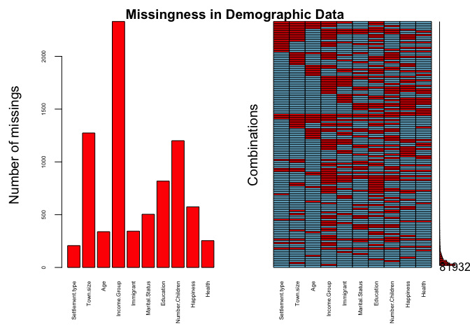<!-- -->

``` r
par(oma=c(0,0,2,0))
plot(aggr(wvs_subset_political, plot = FALSE), 
     numbers = TRUE, 
     cex.axis = .4, 
     prop = FALSE,
     only.miss = TRUE)
title("Missingness in Political Participation Data", outer = TRUE)
```

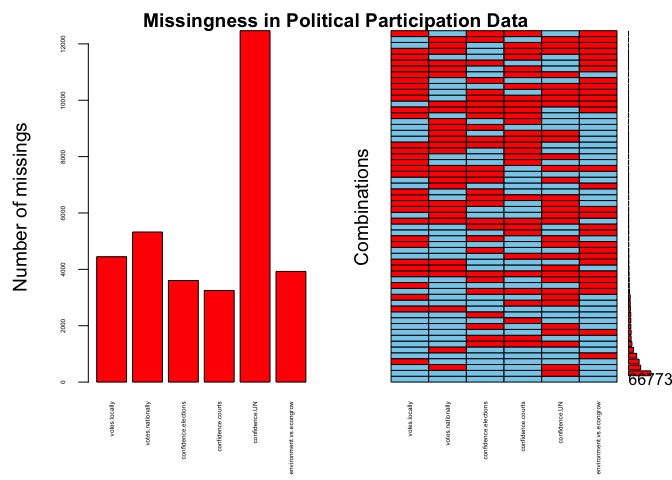<!-- -->

``` r
par(oma=c(0,0,2,0))
plot(aggr(wvs_subset_ethical, plot = FALSE), 
     numbers = TRUE, 
     cex.axis = .6, 
     prop = FALSE,
     only.miss = TRUE)
title("Missingness in Ethical Values Data", outer = TRUE)
```

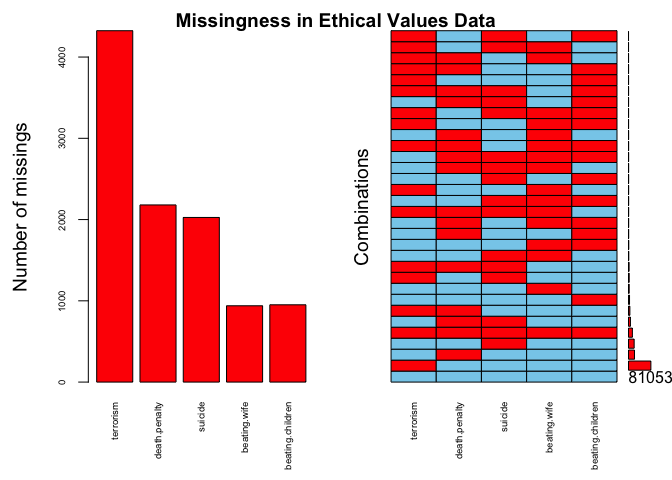<!-- -->

``` r
par(oma=c(0,0,2,0))
plot(aggr(wvs_subset_social, plot = FALSE), 
     numbers = TRUE, 
     cex.axis = .6, 
     prop = FALSE,
     only.miss = TRUE)
title("Missingness in Social Views Data", outer = TRUE)
```

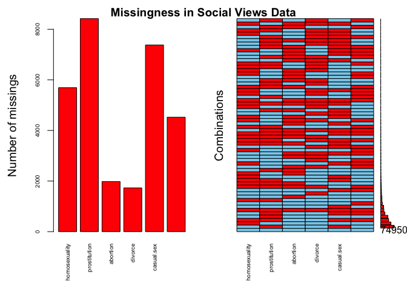<!-- -->

``` r
par(oma=c(0,0,2,0))
plot(aggr(wvs_subset_immigration, plot = FALSE), 
     numbers = TRUE, 
     cex.axis = .3, 
     prop = FALSE,
     only.miss = TRUE)
title("Missingness in Immigration Data", outer = TRUE)
```

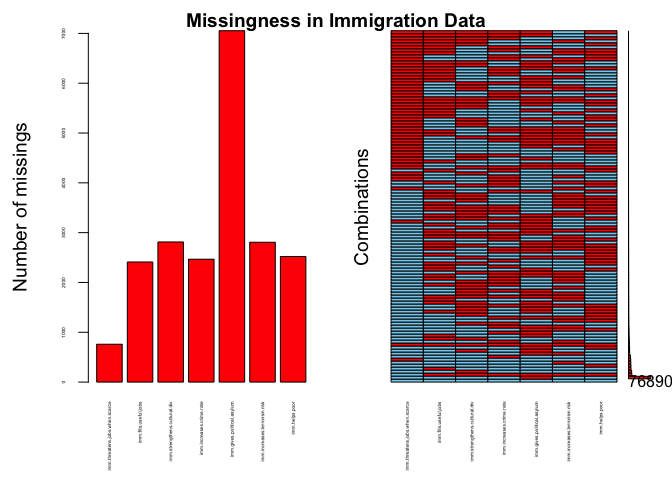<!-- -->

Although the overall completion rate is relatively high (0.9555783), the
VIM plots reveal that missing data is an ubiquitous issue. Furthermore,
our predictive modeling efforts will require complete datasets with no
missing values.

Imputing the data is not a good option. The WVS dataset contains
qualitative survey data, and imputing it would be both unethical and
misrepresentative. Each record contains the beliefs and experiences of a
particular individual. While the mean value of beliefs on homosexuality
in the dataset is 3.8643022 out of 10 (1 = never justifiable, 10 =
always justifiable), if we were to assign this mean value to all those
who chose not to answer this question, we would inaccurately be
contributing to the regression toward the mean.

Retaining the data would be ideal, but our predictive modeling
techniques such as decision trees require “complete cases,” where all
records must be present. For this reason, we are opting to remove
records with missing values. The impact of our decision can be seen
below: `wvs_subset_ordinal` had 87822 rows before cleaning, and …

``` r
wvs_subset_ordinal <- na.omit(wvs_subset_ordinal)
```

… after cleaning `wvs_subset_ordinal` has 49064 rows.

Although this reduces the size of the dataset by a considerable portion,
it is the best option based on our inability to impute nor keep the
data.

**Correlations in the data**:

``` r
# further subsetting to topics of highest interest
wvs_subset_correlations <- 
  wvs_subset_ordinal %>% 
  select(
    # --------------------------- DEMOGRAPHICS
    Settlement.type,
    Town.size,
    Age,
    Income.Group,
    Immigrant,
    Marital.Status,
    Education,
    Number.Children,
    Happiness,
    Health,
    # ------------------- ETHICAL VALUES / SOCIAL VIEWS -------------------
    terrorism,
    death.penalty,
    suicide,
    beating.wife,
    beating.children,
    homosexuality,
    prostitution,
    abortion,
    divorce,
    casual.sex,
    sex.before.marriage,
    # --------------------------- IMMIGRATION ---------------------------
    imm.threatens.jobs.when.scarce,
    imm.fills.useful.jobs,
    imm.strengthens.cultural.div,
    imm.increases.crime.rate,
    imm.gives.political.asylum,
    imm.increases.terrorism.risk,
    imm.helps.poor,
    imm.increases.unemployment,
    imm.brings.social.conflict,
    imm.policy.preference,
  )

# assessing correlations between ordinal, numeric data
# only including our areas of focus: demographics, religion, ethics, immigration
# only including data where pairwise observations are complete (i.e., not including missing data)
cor <- cor(wvs_subset_correlations, use = "pairwise.complete.obs")
corrplot(cor, 
         method = "circle", 
         insig = "blank", 
         diag = FALSE,
         tl.cex = 0.5) %>% 
    corrRect(name = c('Settlement.type', 
                      'terrorism', 
                      'imm.threatens.jobs.when.scarce',
                      'imm.policy.preference'))
```

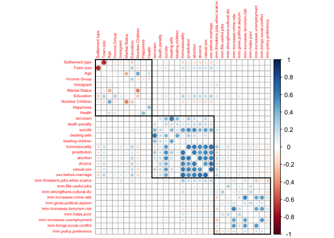<!-- -->

The visualization of a correlation matrix above indicates the extent to
which each variable, compared to one another, correlates or relates.
Darker blue colors represent stronger positive correlations, and darker
orange colors represent stronger negative correlations. For
visualization purposes, we have bucketed the variables into four groups,
but it should be noted that by doing so we risk imposing structure where
it does not, or should not, exist:

-   The first bucket contains variables relating to demographics
-   The second bucket relates to ethical values / social views
-   The third bucket relates to immigration / beliefs about immigrant
    populations

Although this visualization of a correlation matrix reveals many
interesting insights into how our variables correlate, the following are
just a couple of key insights relating to the focus of our project —
religion, immigration, and ethics:

-   Some correlations occur between variables in the first bucket. For
    example, `Settlement.type` and `Town size` are strongly correlated;
    rural areas have few residents, urban areas have many. Similarly,
    `Marital Status` correlates with `Age` and `Number.Children`;
    `Income.Group` correlates with `Education`; `Happiness` correlates
    with `Health`. These are all to be expected.
-   Many correlations occur between variables in the second bucket.
    Likely, this is an indication of liberal versus conservative
    thought. For example, those who hold liberal/conservative views on
    `homosexuality` are also likely to hold respectively
    liberal/conservative views on `abortion`.
-   Some correlations occur between variables in the third bucket.For
    example, those who feel immigration does (or does not) increase
    crime rates also feel immigration does (or does not) increase social
    conflict.

Our correlation matrix has confirmed that we humans are not blind in our
values and beliefs. We seek order and consistency. If we feel one way
about one thing, we will likely feel similarly about another, related
thing. That said, we are complex, and thus the correlation matrix shows
a degree of inconsistency, too.

Having understood what correlates with what, the next step in our
exploratory data analysis will be to explore where clusters form. Using
geospatial visualization techniques, we will assess how views on
religion, immigration, ethics are spread across the globe.

**Visualizing the data**:

``` r
# Creates colored points (gradient) based on particular categorical numeric values in dataframe.
# For display in a map (see examples below)
map_color_range <- function(tibl, col, 
                            min_color = "green", max_color = "red",
                            shape = 1, size = 0.4) {
  min_value <- min(col, na.rm = TRUE)
  max_value <- max(col, na.rm = TRUE)
  # vector of color gradients with a length of `max_value`
  colors <- colorRampPalette(c(min_color, max_color))(max_value)
  # executes points() for each value between min and max
  for (i in min_value:max_value) {
    tibl_subset_col <- 
      tibl %>% 
      filter(col == i) 
    points(tibl_subset_col$Longitude, 
           tibl_subset_col$Latitude, 
           col = alpha(colors[i], 0.1), # colors from color ramp above w/ transparency
           pch = shape, 
           cex = size)
  }
}

map("world")
title(main = "Homosexuality is justifiable (green) vs. never justifiable (red)")
map_color_range(wvs_subset, wvs_subset$homosexuality, 
                min_color = "red", max_color = "green")
```

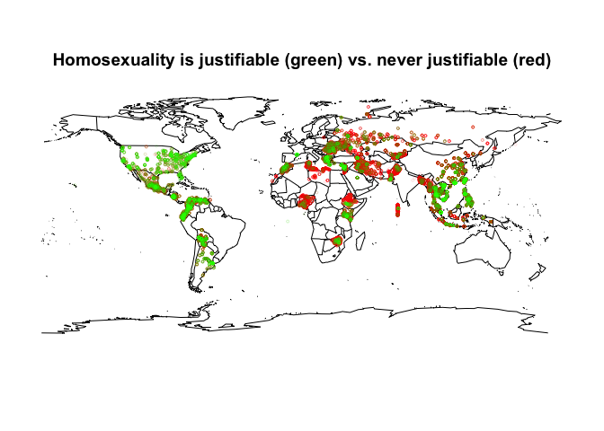<!-- -->

Geospatial data can reveal many interesting trends. For example, we can
visualize beliefs on `homosexuality`, where greener colors represent
those who believe homosexuality is “always justifiable” and redder
colors represent those who believe homosexuality is “never justifiable.”
Eastern Europe and parts of Africa appear most opposed to homosexuality,
whereas North America appear most tolerant.

``` r
map("world")
title(main = "Immigration does (green) or does not (red) increase cultural diversity")
map_color_range(wvs_subset, wvs_subset$imm.strengthens.cultural.div, 
                min_color = "red", max_color = "green")
```

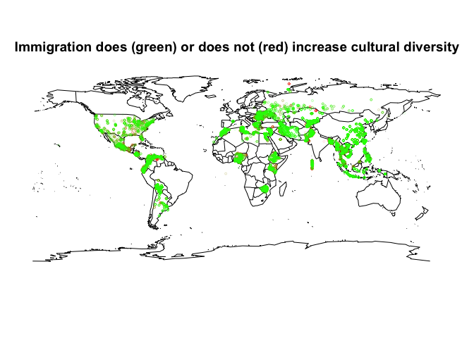<!-- -->

``` r
map("world")
title(main = "Immigration does (red) or does not (green) increase risk of terrorism")
map_color_range(wvs_subset, wvs_subset$imm.increases.terrorism.risk, 
                min_color = "green", max_color = "red")
```

<!-- -->

The two visualizations above, when compared with one another, reveal an
interesting dichotomy in beliefs on immigration. On the one hand, people
across the globe generally say immigration strengthens cultural
diversity. On the other hand, people across the globe also generally say
immigration increases the risk of terrorism.

So the question arises, do people generally support or not support
immigration? What this visualization tells us is that humans have
conflicting beliefs. It may just be the case that we humans can hold
conflicting beliefs. In the field of psychology, this is referred to as
“cognitive dissonance.” As a classic example, meat-eaters may believe
that harming animals is a bad thing, and yet the act of eating meat
contributes to the suffering of animals. Our team feels that beliefs on
immigration may be similar. Humans across the globe generally like the
idea of cultural diversity, and yet when it comes to living alongside
people of different cultures, they may exhibit fearful or cautious
behaviors that suggest otherwise.

The human experience is a many-faceted. Now that we have explored what
correlates with what, and where clusters form, our next step will be to
apply decision trees as a predictive modeling technique to understand
more precisely what variables are most indicative of certain values.

------------------------------------------------------------------------

## Predictive Modeling Techniques and Interpretations

In each of our decision trees, 80% of the data will randomly be placed
into a training set and 20% into a test set. The training sets will be
used to create the decision trees, and the test sets will be used to
test the resulting model’s accuracy. The `rpart` function will build a
model separating the outcome variable into distinct groups, and the
model will determine which variables are deemed most important for
classifying the outcome variable. Node 1 will always serve as the best
classifier for splitting the data into two groups, and the following
nodes serve as the next best classifiers for splitting the data into
groups. This process repeats recursively until no further splitting is
possible or necessary at which point a decision has been reached.

The major question to ask of a decision tree is whether the model is too
complex, too specific, or too sensitive. In other words, did the
recursive process of splitting the data into groups and subgroups
continue on for too long. When should the splitting stop? For each of
our business questions, we will apply the decision tree to our test data
and then to our train data to assess and explain the model’s accuracy.

##### Business Question \#1: Classifying Immigrants versus Nonimmigrants

In this first decision tree, we seek to understand what variables are
most indicative of whether or not someone is an immigrant. A human posed
with this same question might list a number of factors such as
education, income, or number of children, but these would be biased. A
decision tree, on the other hand, will assess all relationships between
all variables in the dataset to produce a simple rule-based model.

``` r
immigrant_tree <- 
  wvs_subset %>% 
  select(-Longitude, -Latitude, -Country.and.year, -Ethnic.Group, -Country)

# partition prep
set.seed(888)
# remove NAs
immigrant_tree <- na.omit(immigrant_tree)

# partition
immigrant_tree_partition <- createDataPartition(y = immigrant_tree$Immigrant, p = 0.8, list = FALSE)
immigrant_tree_train <- na.omit(immigrant_tree[immigrant_tree_partition, ])
immigrant_tree_test <- immigrant_tree[-immigrant_tree_partition, ]

# building the classification tree with rpart
immigrant_tree_model <- rpart(formula = Immigrant ~ .,
                              data = immigrant_tree_train,
                              method = "class")

# Visualize the decision tree with rpart.plot
fancyRpartPlot(immigrant_tree_model, 
               main = "Decision Tree #1: Nonimmigrant or Immigrant\n-- a question of political participation, immigration beliefs, and age --",
               caption = "Nonimmigrant = 1, Immigrant = 2",
               type = 5)
```

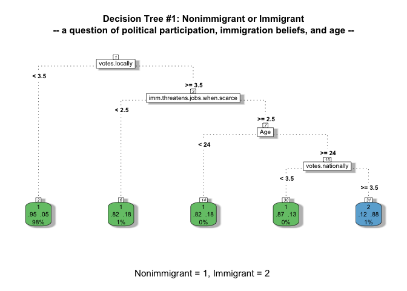<!-- -->

The decision tree boiled all variables down to just several splits. The
path to being classified as an “Immigrant” (2) can be read as follows:

-   Do you rarely vote locally, or are you not allowed to vote locally?
    If so, you may be an immigrant.
-   Do you disagree strongly that immigration threatens jobs? If so, you
    may be an immigrant.
-   Are you 24 years or older? If so, you may be an immigrant.
-   Do you rarely vote nationally, or are you not allowed to vote
    nationally? If so, you are an immigrant.
-   If the answer is no to any of the above questions, you are not an
    immigrant.

What is interesting about these variables is that the first and last
relate to political participation, the second relates to a belief about
immigration, and the third relates to a demographic. The model has
incorporated a convincing spread of variables to come up with its
rule-based output. We can next test for the accuracy of the model using
the test set.

``` r
#Testing the model
pred_immigrant_tree_model <- predict(object = immigrant_tree_model, immigrant_tree_test[-5], type = "class")
immigrant_tree_model_matrix <- table(immigrant_tree_test$Immigrant, pred_immigrant_tree_model)
confusionMatrix(immigrant_tree_model_matrix)
```

    ## Confusion Matrix and Statistics
    ## 
    ##    pred_immigrant_tree_model
    ##        1    2
    ##   1 9042   17
    ##   2  486   69
    ##                                         
    ##                Accuracy : 0.9477        
    ##                  95% CI : (0.943, 0.952)
    ##     No Information Rate : 0.9911        
    ##     P-Value [Acc > NIR] : 1             
    ##                                         
    ##                   Kappa : 0.2029        
    ##                                         
    ##  Mcnemar's Test P-Value : <2e-16        
    ##                                         
    ##             Sensitivity : 0.9490        
    ##             Specificity : 0.8023        
    ##          Pos Pred Value : 0.9981        
    ##          Neg Pred Value : 0.1243        
    ##              Prevalence : 0.9911        
    ##          Detection Rate : 0.9405        
    ##    Detection Prevalence : 0.9423        
    ##       Balanced Accuracy : 0.8757        
    ##                                         
    ##        'Positive' Class : 1             
    ## 

This model is highly accurate (94.77%)! This shows that the model does a
good job on unseen data.

##### Business Question \#2: Predicting whether an individual views teaching tolerance as important based on their beliefs regarding immigration

In this second decision tree, we seek to understand attitudes towards
immigration in relation to a key value: tolerance. By setting up a
decision tree with two questions on immigration that are in some ways in
conflict with one another, we sought to answer the question, “how do
those who believe tolerance is an important teaching for children feel
about immigrants in their immediate lives, and more broadly, as a threat
to security?” The two variables employed to answer this question are to
the effect of, “does immigration increase the risk of terrorism?” and
“would you like to have immigrants as neighbors?”

The following decision tree predicts the importance of teaching children
tolerance based on two viewpoints on immigration: friendliness towards
immigrants as neighbors and whether immigration increases the risk of
terrorism. A decision tree was chosen as the mode of analysis because it
provides a thorough answer to the question of whether those who
emphasize tolerance to their children display tolerance towards
immigrants in their home country.

``` r
# sub-setting data
tree_subset <- 
  wvs %>% 
  select(Immigrants.As.Neighbors = Q21, # 1 = mentioned they wouldn't like this,                                             2 = didn't mention
        Tolerance.Important.For.Children = Q12, # 1 = mentioned to be important,                                                     2 = didn't mention
        Immigration.Increases.Terrorism.Risk = Q126) # 2 = agree, 1 = unsure, 0 = disagree
# skim
tree_skim <- skim(tree_subset)
# prop tables
prop.table(table(tree_subset$Immigrants.As.Neighbors)) # 1 = mentioned they wouldn't like this,                                                  2 = didn't mention
```

    ## 
    ##         1         2 
    ## 0.2195136 0.7804864

``` r
prop.table(table(tree_subset$Tolerance.Important.For.Children)) # 1 = mentioned to be important,                                                      2 = didn't mention
```

    ## 
    ##         1         2 
    ## 0.6289422 0.3710578

``` r
prop.table(table(tree_subset$Immigration.Increases.Terrorism.Risk)) # 2 = agree, 1 = unsure,                                                                     0 = disagree
```

    ## 
    ##         0         1         2 
    ## 0.3215903 0.2225490 0.4558607

``` r
# partition prep
set.seed(1000)
# remove NAs
tree_subset <- na.omit(tree_subset)
# partition
data_partition<-createDataPartition(y=tree_subset$Tolerance.Important.For.Children, p=0.8, list=FALSE)
train <- na.omit(tree_subset[data_partition,])
test <- tree_subset[-data_partition,]
# checking partition and NA omits
nrow(tree_subset)
```

    ## [1] 83576

``` r
nrow(train)
```

    ## [1] 66861

``` r
nrow(test)
```

    ## [1] 16715

``` r
head(train)
```

    ## # A tibble: 6 × 3
    ##   Immigrants.As.Neighbors Tolerance.Important.For.Children Immigration.Increase…
    ##                     <dbl>                            <dbl>                 <dbl>
    ## 1                       2                                2                     2
    ## 2                       2                                1                     2
    ## 3                       2                                1                     2
    ## 4                       2                                1                     2
    ## 5                       2                                1                     2
    ## 6                       2                                1                     2

``` r
# tree plotting
library(rpart)
tolerance_tree <- rpart(formula = Tolerance.Important.For.Children ~., 
                 data = train,
                 method = 'class',
                #minsplit=2,
                cp=-1,
                 #minbucket = 2,
                #parms = list(split = 'gini')
                )

# tree visualization
library(rattle)
library(rpart.plot)
fancyRpartPlot(tolerance_tree, main = "Decision Tree #2: Importance of Teaching Tolerance,\nBased on Beliefs about Immigration", caption = "Tolerance is Important (1) versus Nonimportant (2)", type = 5)
```

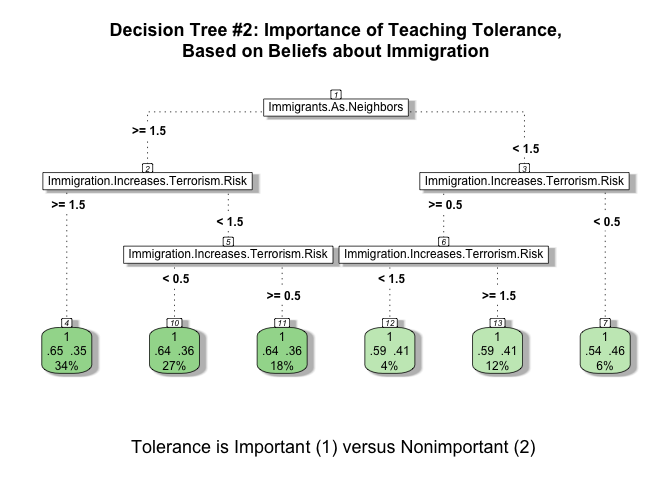<!-- -->

``` r
# Immigrants as neighbors: 1 = wouldn't like  2 = didn't mention
                           #0.2199076           0.7800924
# Tolerance important for children: 1 = yes   2 = didn't mention 
                                  # 0.6282186    0.3717814
# Immigration increases terrorism risk: # 2 = agree, 1 = unsure, 0 = disagree
                                        # 0.4558246,  0.2214990,  0.3226764

# Variable of importance
tolerance_tree$variable.importance # immigrants as neighbors
```

    ##              Immigrants.As.Neighbors Immigration.Increases.Terrorism.Risk 
    ##                            104.23943                             16.19785

``` r
# Test variable prediction
tree_pred<-predict(tolerance_tree,newdata=test,
                   type = 'class',
                   prob = TRUE)

# Measure model performance
library(caret)
table(tree_pred, test$Tolerance.Important.For.Children)
```

    ##          
    ## tree_pred     1     2
    ##         1 10473  6242
    ##         2     0     0

``` r
confusionMatrix(as.factor(tree_pred), as.factor(test$Tolerance.Important.For.Children))
```

    ## Confusion Matrix and Statistics
    ## 
    ##           Reference
    ## Prediction     1     2
    ##          1 10473  6242
    ##          2     0     0
    ##                                           
    ##                Accuracy : 0.6266          
    ##                  95% CI : (0.6192, 0.6339)
    ##     No Information Rate : 0.6266          
    ##     P-Value [Acc > NIR] : 0.5035          
    ##                                           
    ##                   Kappa : 0               
    ##                                           
    ##  Mcnemar's Test P-Value : <2e-16          
    ##                                           
    ##             Sensitivity : 1.0000          
    ##             Specificity : 0.0000          
    ##          Pos Pred Value : 0.6266          
    ##          Neg Pred Value :    NaN          
    ##              Prevalence : 0.6266          
    ##          Detection Rate : 0.6266          
    ##    Detection Prevalence : 1.0000          
    ##       Balanced Accuracy : 0.5000          
    ##                                           
    ##        'Positive' Class : 1               
    ## 

**Findings**:

It may be assumed that immigration viewpoints would be a strong
predictor of importance of teaching children tolerance. If people view
immigrants as an important aspect of their home home country culture and
communities, we would likely describe them as tolerant, among other
things. Therefore, analyzing the results of the decision tree with one
positive question about immigration and one negative, it’s interesting
to see the results on the leaves, which all land close the 50/50 line,
with tolerance being important teaching for children holding the
majority in each leaf. The decision tree is 63% accurate. Decision trees
tend to over fit accuracy without extensive preparation to the training
and test partitions.

**Tolerance Importance: Leaf Interpretation (L-R)**:

-   The vast majority of respondents - *78%* - are neutral of positive
    about the prospect of having neighbors that have immigrated from
    other countries.
-   Of these 78%, 34% of respondents are neutral or positive about
    immigrants as neighbors, and responded that immigration increases
    the risk of terrorism. I’ll classify this group as somewhat
    supportive of immigration (open to immigration in their immediate
    community and wary of immigration in their country). Within this
    leaf, 65% believe in the importance of teaching children tolerance
    (the highest among the leaves).
-   27% are neutral or positive about immigrants as neighbors, and
    disagree that immigration increases the risk of terrorism. I’ll
    classify this group as most open to immigration. Within this leaf,
    64% believe in the importance of teaching tolerance to children.
-   18% are neutral or positive about immigrants as neighbors, and
    unsure about the risk they pose to terrorism. This group is neutral.
-   Within the much smaller cohort that responded that they wouldn’t
    like having immigrants as neighbors - *22%* - 10% are neutral or
    disagree with the question of whether immigiration increases the
    risk of terrorism. I’ll include this group in the somewhat
    supportive of immigration category. This group also believes in
    teaching tolerance to children, though by a slim margin of about 6%.
-   In contrast, 12% of respondents agree that immgiration increases the
    risk of terrorism, and responded negatively to the idea of being
    neighbors with immigrants. This group is classified as the most
    unfavorable to immigration. Still, 59% of this group believes in
    teaching tolerance to children.

Based on this classification system, respondents fall into the following
categories regarding immigration viewpoints: 27% are very supportive,
44% are somewhat supportive, 18% are neutral or unsure, and 12% are not
supportive. The question of whether those who emphasize tolerance to
their children display tolerance towards immigrants in their home
country is answered; every category classified by immigration
viewpoints, including those with negative attitudes, responded that they
believe in teaching tolerance to children.

##### Business Question \#3: Classifying Religious Denominations

In this third decision tree, we seek to understand what variables are
most indicative of religious denomination. A human may observe the foods
someone eats or the rituals someone practices to determine this, but it
will be interested to feed variables in our dataset to a decision tree
to understand which factors are found to be most important in this
classification task.

``` r
religion_tree <-
  wvs_subset %>% 
  select(-Longitude, -Latitude, -Country.and.year, -Ethnic.Group, -Country)

# partition prep
set.seed(888)
# remove NAs
religion_tree <- na.omit(religion_tree)

# partition
religion_tree_partition <- createDataPartition(y = religion_tree$Religion, p = 0.8, list = FALSE)
religion_tree_train <- na.omit(religion_tree[religion_tree_partition, ])
religion_tree_test <- religion_tree[-religion_tree_partition, ]

# building the classification tree with rpart
religion_tree_model <- rpart(formula = Religion ~ .,
                             data = religion_tree_train,
                             method = "class")

# Visualize the decision tree with rpart.plot
fancyRpartPlot(religion_tree_model, 
               main = "Decision Tree #3: Religious Denomination\n-- a question social views, ethical values, and town size --",
               caption = "0 = No religion, 1 = Roman Catholic, 5 = Muslim",
               type = 5)
```

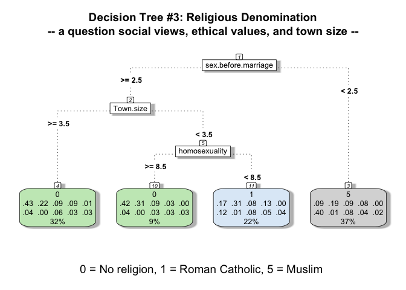<!-- -->

The decision tree boiled all variables down to just several splits. It
even chose to take many of the possible religions out of the question,
likely because there were too few of each to include. The path to being
classified as “Roman Catholic” (1) can be read as follows:

-   Do you believe sex before marriage is justifiable to some extent? If
    so, you may be Roman Catholic.
-   Do you live in a town/city with less than 20,000 residents? If so,
    you may be Roman Catholic.
-   Do you believe homosexuality is not justifiable to some extent? If
    so, you may be Roman Catholic.

Here, the first and last variable considered by the model relates to
social views / ethical values, while the second variable relates to a
demographic. Again, the model has incorporated just what it thinks to be
of utmost importance to come up with its rule-based output. Other
interpretations we can make based on this model are:

-   63% of those in the training set who think sex before marriage is
    justifiable to some extent either do not have a religion or are
    Roman Catholic, the rest are Muslim.
-   The classification of Muslims does not include their town size or
    views on homosexuality. The model would say that beliefs on sex
    before marriage, alone, is enough to classify whether or not someone
    is Muslim.

Already, this model seems slightly problematic. There may be people who
are not Muslim who similarly believe sex before marriage is never
justifiable, but the model at present would classify all people who
share this belief as Muslim. As a next step, we can test the accuracy of
the model by feeding it the test set.

``` r
#Testing the model
pred_religion_tree_model <- predict(object = religion_tree_model, religion_tree_test[-6], type = "class")
religion_tree_model_matrix <- table(religion_tree_test$Religion, pred_religion_tree_model)
confusionMatrix(religion_tree_model_matrix)
```

    ## Confusion Matrix and Statistics
    ## 
    ##    pred_religion_tree_model
    ##        0    1    2    3    4    5    6    7    8    9
    ##   0 1640  389    0    0    0  307    0    0    0    0
    ##   1  962  620    0    0    0  711    0    0    0    0
    ##   2  368  169    0    0    0  308    0    0    0    0
    ##   3  311  322    0    0    0  241    0    0    0    0
    ##   4   32    8    0    0    0    4    0    0    0    0
    ##   5  153  258    0    0    0 1436    0    0    0    0
    ##   6   12   13    0    0    0   36    0    0    0    0
    ##   7  224  153    0    0    0  285    0    0    0    0
    ##   8  124  103    0    0    0  127    0    0    0    0
    ##   9  128   93    0    0    0   75    0    0    0    0
    ## 
    ## Overall Statistics
    ##                                           
    ##                Accuracy : 0.3845          
    ##                  95% CI : (0.3748, 0.3943)
    ##     No Information Rate : 0.4114          
    ##     P-Value [Acc > NIR] : 1               
    ##                                           
    ##                   Kappa : 0.2075          
    ##                                           
    ##  Mcnemar's Test P-Value : NA              
    ## 
    ## Statistics by Class:
    ## 
    ##                      Class: 0 Class: 1 Class: 2 Class: 3 Class: 4 Class: 5
    ## Sensitivity            0.4148   0.2914       NA       NA       NA   0.4068
    ## Specificity            0.8770   0.7765  0.91209  0.90907 0.995422   0.9324
    ## Pos Pred Value         0.7021   0.2704       NA       NA       NA   0.7775
    ## Neg Pred Value         0.6820   0.7940       NA       NA       NA   0.7303
    ## Prevalence             0.4114   0.2214  0.00000  0.00000 0.000000   0.3672
    ## Detection Rate         0.1706   0.0645  0.00000  0.00000 0.000000   0.1494
    ## Detection Prevalence   0.2430   0.2386  0.08791  0.09093 0.004578   0.1922
    ## Balanced Accuracy      0.6459   0.5339       NA       NA       NA   0.6696
    ##                      Class: 6 Class: 7 Class: 8 Class: 9
    ## Sensitivity                NA       NA       NA       NA
    ## Specificity          0.993654  0.93113  0.96317  0.96921
    ## Pos Pred Value             NA       NA       NA       NA
    ## Neg Pred Value             NA       NA       NA       NA
    ## Prevalence           0.000000  0.00000  0.00000  0.00000
    ## Detection Rate       0.000000  0.00000  0.00000  0.00000
    ## Detection Prevalence 0.006346  0.06887  0.03683  0.03079
    ## Balanced Accuracy          NA       NA       NA       NA

This model is highly inaccurate (38.45%)! This shows that the model does
a poor job on unseen data. A possible reason for this is the skewness in
the distributions of data on different religious denominations. A
recommended next step would be to employ random sampling techniques on
the dataset to normalize the distributions of each religious
denomination prior to creating training and test splits.

##### Business Question \#4: Predicting Confidence in Elections

In this fourth and final decision tree, we seek to answer the question
of whether those who have faith in elections also have faith in the
courts and the United Nations (UN). Elections operate as the bedrock of
democracy, but in countries without democracy, elections are often
futile systems (or at least perceived to be).

Taking a quick step back to exploratory visualizations, it would be
interesting to see, globally, how confident people are about their
countrys’ elections.

``` r
map("world")
title(main = "Confident (green) vs. not confident (red) in election process")
map_color_range(wvs_subset, wvs_subset$confidence.elections, 
                min_color = "green", max_color = "red")
```

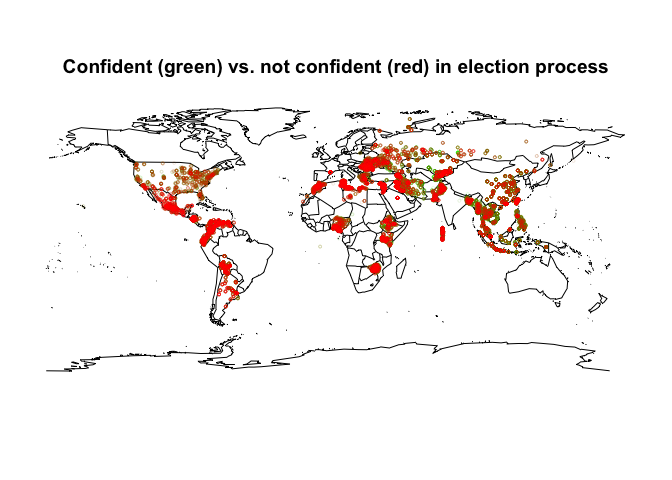<!-- -->

It appears overall we humans do not trust elections! Therefore, it’s
worthwhile and interesting to assess the relationship, if any, between
confidence in elections, courts, and the UN. A decision tree was chosen
for this reason, and because these questions were answered on the same
Likert scale, making for a clearer classification from the algorithm.

``` r
tree_four <- 
  wvs_subset %>% 
  select(-Longitude, -Latitude, -Country.and.year, -Ethnic.Group, -Country)

# partition prep
set.seed(1200)

# remove NAs
tree_four <- na.omit(tree_four)

# partition
four_partition <- createDataPartition(y = tree_four$confidence.elections, p = 0.8, list = FALSE)
four_train <- na.omit(tree_four[four_partition, ])
four_test <- tree_four[-four_partition, ]

# building the classification tree with rpart
four_model <- rpart(formula = confidence.elections ~ .,
                             data = four_train,
                             method = "class")

# Visualize the decision tree with rpart.plot
fancyRpartPlot(four_model, 
               main = "Decision Tree #4: Predicting Confidence in Elections",
               caption = "Confidence Level:\n1 = A great deal, 2 = Quite a lot, 3 = Not very much, 4 = Not a lot",
               type = 5)
```

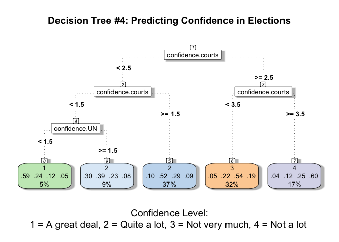<!-- -->

-   The response scale is the same among each of the variables included
    in this decision tree. Confidence in courts and confidence in the
    United Nations (UN) are used to predict confidence in elections.

**Confidence in Elections: Leaf Interpretation (L-R)**:

-   High and low confidence in the courts is split almost 50/50, with
    51% of respondents reporting at least quite a bit of confidence in
    the court, and 49% of respondents reporting less than or equal to
    not very much confidence in the court system.
-   5% of respondents have a great deal of confidence in the UN, courts,
    and elections. This means that only 1 in 20 people have a lot of
    confidence in all 3 bodies in their country.
-   9% of respondents have a great deal of confidence in courts, and
    quite a lot of confidence in the UN and elections.
-   37% of respondents have quite a lot of confidence in courts and
    elections.
-   32% of respondents have not very much confidence in courts, or
    elections.
-   17% of respondents have not a lot of confidence in courts or
    elections.

In summary, results indicate that half of respondents have little trust
in public systems like the courts, elections, and the UN, while the
other half have moderate-to-high levels of trust in each. A mere 5% of
respondents rated all 3 institutions with the highest level of trust,
validating the popular culture idea that there is widespread public
skepticism concerning political systems.

Next, we will assess the model’s accuracy by feeding it the test set.

``` r
# Variable of importance
four_model$variable.importance # confidence in courts
```

    ##            confidence.courts                confidence.UN 
    ##                 3491.4097902                  963.8391002 
    ## imm.strengthens.cultural.div               Marital.Status 
    ##                  177.0408322                  171.4869921 
    ##         gov.email.monitoring   imm.increases.unemployment 
    ##                  169.9821341                  168.7587899 
    ##                    Happiness                       Health 
    ##                    9.9118069                    1.4173747 
    ##             beating.children                          Age 
    ##                    1.1547821                    0.5773910 
    ##              Number.Children 
    ##                    0.3909662

``` r
# Test variable prediction
four_pred<-predict(four_model,newdata=four_test,
                   type = 'class',
                   prob = TRUE)

# Measure model performance
library(caret)
table(four_pred, four_test$confidence.elections)
```

    ##          
    ## four_pred    1    2    3    4
    ##         1  283  129   47   23
    ##         2  591 2221 1252  379
    ##         3  167  659 1696  573
    ##         4   48  173  360 1012

``` r
confusionMatrix(as.factor(four_pred), as.factor(four_test$confidence.elections))
```

    ## Confusion Matrix and Statistics
    ## 
    ##           Reference
    ## Prediction    1    2    3    4
    ##          1  283  129   47   23
    ##          2  591 2221 1252  379
    ##          3  167  659 1696  573
    ##          4   48  173  360 1012
    ## 
    ## Overall Statistics
    ##                                           
    ##                Accuracy : 0.5422          
    ##                  95% CI : (0.5322, 0.5522)
    ##     No Information Rate : 0.349           
    ##     P-Value [Acc > NIR] : < 2.2e-16       
    ##                                           
    ##                   Kappa : 0.341           
    ##                                           
    ##  Mcnemar's Test P-Value : < 2.2e-16       
    ## 
    ## Statistics by Class:
    ## 
    ##                      Class: 1 Class: 2 Class: 3 Class: 4
    ## Sensitivity           0.25987   0.6980   0.5055   0.5093
    ## Specificity           0.97665   0.6545   0.7764   0.9238
    ## Pos Pred Value        0.58714   0.4999   0.5480   0.6353
    ## Neg Pred Value        0.91173   0.8141   0.7455   0.8784
    ## Prevalence            0.11328   0.3310   0.3490   0.2067
    ## Detection Rate        0.02944   0.2310   0.1764   0.1053
    ## Detection Prevalence  0.05014   0.4622   0.3220   0.1657
    ## Balanced Accuracy     0.61826   0.6762   0.6410   0.7166

Model accuracy is 54%. Decision trees do not consider the
interdependence of variables when calculating a split, so using a random
forest instead of one decision tree results in a more accurate model.
Another way to improve accuracy is k-fold cross validation. For the
purposes of this business question, the model and it’s accuracy suffice.

------------------------------------------------------------------------

## Interpretations

**Summary**:

Our initial exploratory data analysis and subsequent findings from
decision trees have begun to supply answers on each of our decision
trees, which we will summarize below:

-   Immigration-related – \#1: Predicting whether or not an individual
    is an immigrant – \#2: Predicting whether an individual views
    teaching tolerance as important based on their beliefs regarding
    immigration

Our geospatial visualizations revealed that views on immigration are
contradictory. People across the globe value cultural diversity and yet
are simultaneously fearful of immigrants. In terms of what it means to
be an immigrant, our first decision tree found that it is a combination
of demographic factors, paired with political participation, paired with
ethical values. Our second decision tree found that people generally
value teaching tolerance in their households irrespective of their
beliefs regarding immigration, which is somewhat counter-intuitive as it
would be natural to think that views on tolerance and views on
immigration correlate.

-   \#3: Predicting the religious denomination of an individual

Our third decision tree brought together an interesting pairing of
ethical values and demographic factors as determinants of religious
denomination. Although the model accuracy was low, there is likely truth
in the statement that religious denomination goes hand-in-hand with
ethical values. Demographic factors such as town size, too, must have an
affect on religious denomination, as smaller towns may be more communal
and/or their inhabitants more reliant upon one another and thus more
homogeneous in terms of religious denomination, whereas larger, urban
areas might be more agnostic due to their diversity.

-   \#4: Predicting an individual’s confidence in elections

Our final decision tree and accompanying geospatial visualization
revealed the world, overall, is not very confident in governmental
organizations and structures. However, those who believe in courts are
more likely to also believe in elections, and those who believe in both
are more likely to believe in the UN, too. This is another example of
humans exhibiting consistent identity traits, where those who identify
as supporters of governmental structures or organizations are likely to
consistently identify as supporters of all-things government. On the
other hand, those lacking trust in governmental structures or
organizations will generally lack trust across the board when it comes
to such topics.

**Final Thoughts**:

Humans are complex. We are moderately to extremely consistent on some
things (e.g., beliefs on governmental organizations, religion, ethics),
but then we are moderately to extremely inconsistent on other things
(e.g., immigration). We set out to explore the various facets of the
human experience, and we now culminate with a deeper understanding of
what makes a human a human.

## Recommendations & Conclusions

-   Next, we plan to integrate feedback from Professor Hodeghatta to our
    final report and presentation.
-   We will be selecting aspects of our analysis to include in a
    PowerPoint presentation for classmates next Wednesday, which will
    require zeroing in on a select few analyses that are
    visually-focused, namely graphs and decision tress.
-   Future analysis would touch on those issues that we were not able to
    cover. These included the relationship between education completed
    (Q275) and the importance of leisure time (Q3); the relationship
    between income (Q288), happiness (Q46), and health (Q47); and the
    relationship between marital status (Q273) and political engagement
    (Q209 - Q222).
-   Future analysis would include more advanced predictive modeling
    techniques, starting with random forests. We cannot know what we
    have not yet studied, but we would hope to find other useful
    modeling techniques beyond decision trees that pair well with
    ordinal (Likert) data!

## Works Cited

<div id="refs" class="references csl-bib-body hanging-indent">

<div id="ref-wvs" class="csl-entry">

Haerpfer, Inglehart, C. n.d. “World Values Survey: Round Seven -
Country-Pooled Datafile Version 4.0.”
<http://dx.doi.org/10.14281/18241.18>.
<https://doi.org/10.14281/18241.18>.

</div>

<div id="ref-R-Replace-Matching" class="csl-entry">

Taiyun Wei, Viliam Simko. 2021. “An Introduction to Corrplot Package.”
<https://cran.r-project.org/web/packages/corrplot/vignettes/corrplot-intro.html>.

</div>

</div>
