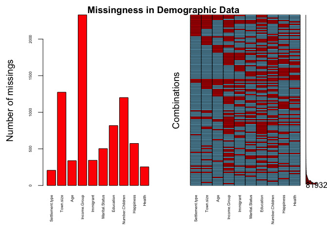
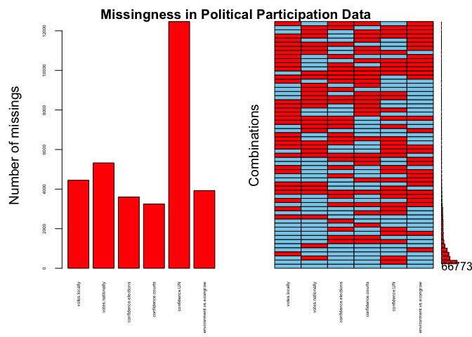
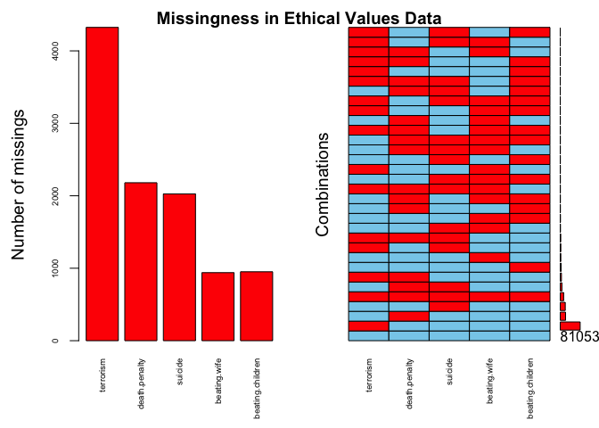
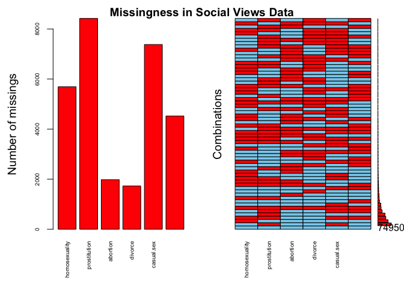
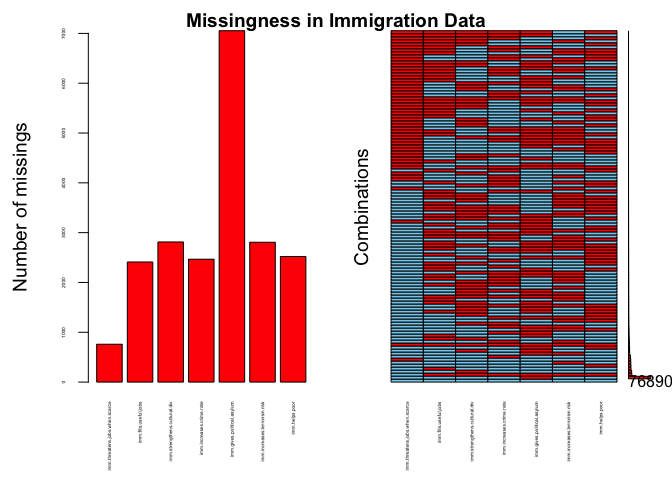

Module 6 Final Project — Final Report
================
Abby Bridgers and Justin Ehringhaus
Last edited August 15, 2022 at 16:30

-   <a href="#introduction" id="toc-introduction">Introduction</a>
    -   <a href="#overview" id="toc-overview">Overview</a>
    -   <a href="#methods-and-business-questions"
        id="toc-methods-and-business-questions">Methods and Business
        Questions</a>
-   <a href="#data-preparation" id="toc-data-preparation">Data
    Preparation</a>
-   <a href="#exploratory-data-analysis"
    id="toc-exploratory-data-analysis">Exploratory Data Analysis</a>

------------------------------------------------------------------------

``` r
library(pacman)
p_load(tidyverse)  # usual suite of packages
p_load(ggthemes)   # extra themes
p_load(hrbrthemes) # more extra themes
p_load(skimr)      # alternative to summary(), skims dataset: skim()
p_load(VIM)        # visualization of missing values: aggr()
p_load(corrplot)   # visualization of a correlation matrix: corrplot()
p_load(maps)       # world map
p_load(rattle)
p_load(rpart, rpart.plot)
p_load(caret)
```

------------------------------------------------------------------------

## Introduction

##### Overview

The World Values Survey (WVS) aims to understand the values, beliefs,
and norms of people all over the world, comparatively and
longitudinally. Operating in more than 120 countries and conducted every
five years, the WVS uses a common questionnaire and a household
interview format to investigate human beliefs. The data is made
available in waves. Time series data including all waves pooled between
1981-2022 is also available.

While examining the pooled dataset would certainly be interesting to
answer questions about changes in worldwide values, beliefs, and norms,
we are opting to limit the scope of our project to recent years (Wave 7:
2017-2022). Already, the size and scope of this dataset represents a big
step for our group’s budding data analysts, as we have never yet worked
with anything so large and so faceted. The Wave 7 dataset contains 552
variables and 87,822 rows. We have reduced the number of attributes by
about 90%. More details to follow.

##### Methods and Business Questions

Our team is interested in exploring values on religion, immigration,
ethics, and governmental-related topics. We analyze particular subsets
of the dataset using exploratory and predictive techniques suited to the
size, scope, and types of data under consideration. For example, we
chose to incorporate geospatial visualization techniques as our dataset
relates to the world, and we chose to orient our predictive modeling
around decision trees because of our restriction to ordinal (Likert)
data. Our analyses are inspired by the four business questions listed
below:

-   \#1: Predicting whether or not an individual is an immigrant
-   \#2: Predicting whether an individual views teaching tolerance as
    important based on their beliefs regarding immigration
-   \#3: Predicting the religious denomination of an individual
-   \#4: Predicting an individual’s confidence in elections

------------------------------------------------------------------------

## Data Preparation

``` r
# importing the entire dataset
wvs <- read_csv("../WVS_Cross-National_Wave_7_csv_v4_0.csv")

# checking first few rows and columns for import success
head(wvs)[,1:5]
```

    ## # A tibble: 6 × 5
    ##   version            doi                       A_WAVE A_YEAR A_STUDY
    ##   <chr>              <chr>                      <dbl>  <dbl>   <dbl>
    ## 1 4-0-0 (2022-05-23) doi.org/10.14281/18241.18      7   2019       2
    ## 2 4-0-0 (2022-05-23) doi.org/10.14281/18241.18      7   2019       2
    ## 3 4-0-0 (2022-05-23) doi.org/10.14281/18241.18      7   2019       2
    ## 4 4-0-0 (2022-05-23) doi.org/10.14281/18241.18      7   2019       2
    ## 5 4-0-0 (2022-05-23) doi.org/10.14281/18241.18      7   2019       2
    ## 6 4-0-0 (2022-05-23) doi.org/10.14281/18241.18      7   2019       2

``` r
wvs_subset <- 
  wvs %>% 
  select(
    # --------------------------- DEMOGRAPHICS
    Country = B_COUNTRY_ALPHA,
    Longitude = O1_LONGITUDE,
    Latitude = O2_LATITUDE,
    Settlement.type = H_SETTLEMENT,
    Country.and.year = S025,
    Town.size = G_TOWNSIZE2,
    Age = Q262,
    Income.Group = Q288,
    Ethnic.Group = Q290, # see WVS_codebook.pdf for Q290 coding info
    Immigrant = Q263,
    Religion = Q289,
    Marital.Status = Q273,
    Education = Q275,
    Number.Children = Q274,
    Happiness = Q46,
    Health = Q47,
    # --------------------------- POLITICAL PARTICIPATION / CONFIDENCE IN GOVERNMENT
    votes.locally = Q221,
    votes.nationally = Q222,
    confidence.elections = Q76,
    confidence.courts = Q70,
    confidence.UN = Q83,
    environment.vs.econgrow = Q111,
    # --------------------------- RELATIONSHIP BETWEEN GOVERNMENT AND CITIZENS
    cheating.taxes = Q180,
    gov.video.surveillance = Q196,
    gov.email.monitoring = Q197,
    gov.collecting.info = Q198,
    # --------------------------- ETHICAL VALUES ---------------------------
    terrorism = Q192,
    death.penalty = Q195,
    suicide = Q187,
    beating.wife = Q189,
    beating.children = Q190,
    # --------------------------- SOCIAL VIEWS ---------------------------
    homosexuality = Q182,
    prostitution = Q183,
    abortion = Q184,
    divorce = Q185,
    casual.sex = Q193,
    sex.before.marriage = Q186,
    # --------------------------- CAREER VALUES ---------------------------
    importance.leisure.time = Q3,
    importance.work = Q5,
    # --------------------------- IMMIGRATION ---------------------------
    imm.threatens.jobs.when.scarce = Q34,
    imm.fills.useful.jobs = Q122,
    imm.strengthens.cultural.div = Q123,
    imm.increases.crime.rate = Q124,
    imm.gives.political.asylum = Q125,
    imm.increases.terrorism.risk = Q126,
    imm.helps.poor = Q127,
    imm.increases.unemployment = Q128,
    imm.brings.social.conflict = Q129,
    imm.policy.preference = Q130
    )
```

------------------------------------------------------------------------

## Exploratory Data Analysis

**Skimming the data**:

``` r
myskim <- skim(wvs_subset)
myskim
```

|                                                  |            |
|:-------------------------------------------------|:-----------|
| Name                                             | wvs_subset |
| Number of rows                                   | 87822      |
| Number of columns                                | 49         |
| \_\_\_\_\_\_\_\_\_\_\_\_\_\_\_\_\_\_\_\_\_\_\_   |            |
| Column type frequency:                           |            |
| character                                        | 1          |
| numeric                                          | 48         |
| \_\_\_\_\_\_\_\_\_\_\_\_\_\_\_\_\_\_\_\_\_\_\_\_ |            |
| Group variables                                  | None       |

Data summary

**Variable type: character**

| skim_variable | n_missing | complete_rate | min | max | empty | n_unique | whitespace |
|:--------------|----------:|--------------:|----:|----:|------:|---------:|-----------:|
| Country       |         0 |             1 |   3 |   3 |     0 |       59 |          0 |

**Variable type: numeric**

| skim_variable                  | n_missing | complete_rate |       mean |         sd |        p0 |        p25 |        p50 |        p75 |       p100 | hist  |
|:-------------------------------|----------:|--------------:|-----------:|-----------:|----------:|-----------:|-----------:|-----------:|-----------:|:------|
| Longitude                      |     27098 |          0.69 |      36.16 |      68.09 |   -156.34 |       7.66 |      39.94 |     100.27 |     156.89 | ▁▃▅▇▇ |
| Latitude                       |     27094 |          0.69 |      21.35 |      19.95 |    -43.26 |       6.99 |      24.75 |      35.70 |     100.35 | ▁▅▇▂▁ |
| Settlement.type                |       207 |          1.00 |       3.07 |       1.50 |      1.00 |       2.00 |       3.00 |       5.00 |       5.00 | ▆▆▅▅▇ |
| Country.and.year               |         0 |          1.00 | 4255875.58 | 2465523.95 | 202018.00 | 1702018.00 | 4172020.00 | 6302018.00 | 8622021.00 | ▇▃▇▅▆ |
| Town.size                      |      1274 |          0.99 |       3.15 |       1.45 |      1.00 |       2.00 |       3.00 |       5.00 |       5.00 | ▆▅▆▆▇ |
| Age                            |       339 |          1.00 |      42.85 |      16.36 |     16.00 |      29.00 |      41.00 |      55.00 |     103.00 | ▇▇▆▂▁ |
| Income.Group                   |      2330 |          0.97 |       4.86 |       2.08 |      1.00 |       3.00 |       5.00 |       6.00 |      10.00 | ▃▅▇▃▁ |
| Ethnic.Group                   |      9486 |          0.89 |  416251.81 |  250427.10 |  20001.00 |  158002.00 |  410004.00 |  630001.00 |  862005.00 | ▇▃▇▅▅ |
| Immigrant                      |       344 |          1.00 |       1.06 |       0.24 |      1.00 |       1.00 |       1.00 |       1.00 |       2.00 | ▇▁▁▁▁ |
| Religion                       |      2485 |          0.97 |       3.00 |       2.62 |      0.00 |       1.00 |       3.00 |       5.00 |       9.00 | ▇▃▆▂▁ |
| Marital.Status                 |       504 |          0.99 |       2.65 |       2.15 |      1.00 |       1.00 |       1.00 |       5.00 |       6.00 | ▇▁▁▁▃ |
| Education                      |       818 |          0.99 |       3.55 |       2.03 |      0.00 |       2.00 |       3.00 |       5.00 |       8.00 | ▃▇▂▅▂ |
| Number.Children                |      1201 |          0.99 |       1.77 |       1.74 |      0.00 |       0.00 |       2.00 |       3.00 |      24.00 | ▇▁▁▁▁ |
| Happiness                      |       574 |          0.99 |       1.86 |       0.71 |      1.00 |       1.00 |       2.00 |       2.00 |       4.00 | ▅▇▁▂▁ |
| Health                         |       254 |          1.00 |       2.19 |       0.87 |      1.00 |       2.00 |       2.00 |       3.00 |       5.00 | ▃▇▅▁▁ |
| votes.locally                  |      4448 |          0.95 |       1.65 |       0.84 |      1.00 |       1.00 |       1.00 |       2.00 |       4.00 | ▇▃▁▂▁ |
| votes.nationally               |      5325 |          0.94 |       1.59 |       0.84 |      1.00 |       1.00 |       1.00 |       2.00 |       4.00 | ▇▃▁▂▁ |
| confidence.elections           |      3604 |          0.96 |       2.63 |       0.95 |      1.00 |       2.00 |       3.00 |       3.00 |       4.00 | ▃▇▁▇▅ |
| confidence.courts              |      3250 |          0.96 |       2.44 |       0.94 |      1.00 |       2.00 |       2.00 |       3.00 |       4.00 | ▃▇▁▆▃ |
| confidence.UN                  |     12467 |          0.86 |       2.59 |       0.94 |      1.00 |       2.00 |       3.00 |       3.00 |       4.00 | ▃▇▁▇▅ |
| environment.vs.econgrow        |      3927 |          0.96 |       1.46 |       0.56 |      1.00 |       1.00 |       1.00 |       2.00 |       3.00 | ▇▁▆▁▁ |
| cheating.taxes                 |      1134 |          0.99 |       2.22 |       2.14 |      1.00 |       1.00 |       1.00 |       3.00 |      10.00 | ▇▁▁▁▁ |
| gov.video.surveillance         |      3169 |          0.96 |       2.28 |       1.10 |      1.00 |       1.00 |       2.00 |       3.00 |       4.00 | ▇▇▁▅▅ |
| gov.email.monitoring           |      3941 |          0.96 |       2.89 |       1.07 |      1.00 |       2.00 |       3.00 |       4.00 |       4.00 | ▃▅▁▆▇ |
| gov.collecting.info            |      3633 |          0.96 |       2.95 |       1.07 |      1.00 |       2.00 |       3.00 |       4.00 |       4.00 | ▂▃▁▅▇ |
| terrorism                      |      4324 |          0.95 |       1.80 |       1.81 |      1.00 |       1.00 |       1.00 |       2.00 |      10.00 | ▇▁▁▁▁ |
| death.penalty                  |      2180 |          0.98 |       4.12 |       3.19 |      1.00 |       1.00 |       3.00 |       7.00 |      10.00 | ▇▂▃▂▂ |
| suicide                        |      2026 |          0.98 |       2.49 |       2.37 |      1.00 |       1.00 |       1.00 |       3.00 |      10.00 | ▇▁▂▁▁ |
| beating.wife                   |       939 |          0.99 |       1.85 |       1.85 |      1.00 |       1.00 |       1.00 |       2.00 |      10.00 | ▇▁▁▁▁ |
| beating.children               |       951 |          0.99 |       2.87 |       2.55 |      1.00 |       1.00 |       1.00 |       5.00 |      10.00 | ▇▂▂▁▁ |
| homosexuality                  |      5691 |          0.94 |       3.86 |       3.34 |      1.00 |       1.00 |       2.00 |       6.00 |      10.00 | ▇▂▂▁▂ |
| prostitution                   |      8421 |          0.90 |       2.97 |       2.65 |      1.00 |       1.00 |       1.00 |       5.00 |      10.00 | ▇▂▂▁▁ |
| abortion                       |      1979 |          0.98 |       3.41 |       2.92 |      1.00 |       1.00 |       2.00 |       5.00 |      10.00 | ▇▂▂▁▁ |
| divorce                        |      1729 |          0.98 |       4.90 |       3.17 |      1.00 |       1.00 |       5.00 |       8.00 |      10.00 | ▇▃▆▃▅ |
| casual.sex                     |      7380 |          0.92 |       3.43 |       2.98 |      1.00 |       1.00 |       2.00 |       5.00 |      10.00 | ▇▂▂▁▂ |
| sex.before.marriage            |      4525 |          0.95 |       4.51 |       3.38 |      1.00 |       1.00 |       4.00 |       8.00 |      10.00 | ▇▂▃▂▃ |
| importance.leisure.time        |       473 |          0.99 |       1.79 |       0.78 |      1.00 |       1.00 |       2.00 |       2.00 |       4.00 | ▇▇▁▂▁ |
| importance.work                |      1047 |          0.99 |       1.54 |       0.77 |      1.00 |       1.00 |       1.00 |       2.00 |       4.00 | ▇▃▁▁▁ |
| imm.threatens.jobs.when.scarce |       760 |          0.99 |       2.17 |       1.16 |      1.00 |       1.00 |       2.00 |       3.00 |       5.00 | ▇▇▃▃▁ |
| imm.fills.useful.jobs          |      2411 |          0.97 |       1.18 |       0.86 |      0.00 |       0.00 |       1.00 |       2.00 |       2.00 | ▅▁▃▁▇ |
| imm.strengthens.cultural.div   |      2813 |          0.97 |       1.27 |       0.86 |      0.00 |       0.00 |       2.00 |       2.00 |       2.00 | ▃▁▃▁▇ |
| imm.increases.crime.rate       |      2467 |          0.97 |       1.15 |       0.87 |      0.00 |       0.00 |       1.00 |       2.00 |       2.00 | ▆▁▃▁▇ |
| imm.gives.political.asylum     |      7054 |          0.92 |       1.20 |       0.84 |      0.00 |       0.00 |       1.00 |       2.00 |       2.00 | ▅▁▅▁▇ |
| imm.increases.terrorism.risk   |      2807 |          0.97 |       1.13 |       0.87 |      0.00 |       0.00 |       1.00 |       2.00 |       2.00 | ▆▁▃▁▇ |
| imm.helps.poor                 |      2521 |          0.97 |       1.37 |       0.81 |      0.00 |       1.00 |       2.00 |       2.00 |       2.00 | ▃▁▃▁▇ |
| imm.increases.unemployment     |      2076 |          0.98 |       1.21 |       0.87 |      0.00 |       0.00 |       2.00 |       2.00 |       2.00 | ▅▁▃▁▇ |
| imm.brings.social.conflict     |      2530 |          0.97 |       1.23 |       0.85 |      0.00 |       0.00 |       1.00 |       2.00 |       2.00 | ▅▁▃▁▇ |
| imm.policy.preference          |      5149 |          0.94 |       2.58 |       0.80 |      1.00 |       2.00 |       3.00 |       3.00 |       4.00 | ▂▆▁▇▂ |

The subset of the dataset contains 87822 rows and 49 columns. As many of
the variables are ordinal (Likert scales), the descriptive statistics
generated by the skim give an accurate picture of their distribution and
the characteristics. However, certain variables such as `Ethnic.Group`,
`Country.and.year`, `Longitude`, and `Latitude` contain nominal, numeric
data, and thus the descriptive statistics for these variables can be
ignored as it is meaningless.

Most variables are numeric; only `Country` is classified as a character
vector. `Longitude` and `Latitude` are missing the most data with a
completion rate of 0.6914441, but overall the mean completion rate is
0.9555783. This overall high completion rate signifies that missing data
is not too much of an issue for the particular variables we are
considering. However, it is necessary to assess whether missing data
should be removed, retained, or imputed.

The `aggr` function from the VIM package can help in visualizing
combinations of missing values, which will be useful for understanding
what variables are missing the most data and what combinations of
variables are missing the most data. Keeping in mind our subset contains
87822 rows, the number on the bottom-right of each plot below shows the
number of “complete cases,” where no data is missing.

``` r
# ordinal, numeric data only
wvs_subset_ordinal <- 
  wvs_subset %>% 
  select(-Longitude,
         -Latitude,
         -Country, 
         -Ethnic.Group, 
         -Country.and.year,
         -Religion)

wvs_subset_demographic <- wvs_subset_ordinal[1:10]
wvs_subset_political <- wvs_subset_ordinal[11:16]
wvs_subset_ethical <- wvs_subset_ordinal[21:25]
wvs_subset_social <- wvs_subset_ordinal[26:31]
wvs_subset_immigration <- wvs_subset_ordinal[34:40]

par(oma=c(0,0,2,0))
plot(aggr(wvs_subset_demographic, plot = FALSE), 
     numbers = TRUE, 
     cex.axis = .5, 
     prop = FALSE,
     only.miss = TRUE)
title("Missingness in Demographic Data", outer = TRUE)
```

<!-- -->

``` r
par(oma=c(0,0,2,0))
plot(aggr(wvs_subset_political, plot = FALSE), 
     numbers = TRUE, 
     cex.axis = .4, 
     prop = FALSE,
     only.miss = TRUE)
title("Missingness in Political Participation Data", outer = TRUE)
```

<!-- -->

``` r
par(oma=c(0,0,2,0))
plot(aggr(wvs_subset_ethical, plot = FALSE), 
     numbers = TRUE, 
     cex.axis = .6, 
     prop = FALSE,
     only.miss = TRUE)
title("Missingness in Ethical Values Data", outer = TRUE)
```

<!-- -->

``` r
par(oma=c(0,0,2,0))
plot(aggr(wvs_subset_social, plot = FALSE), 
     numbers = TRUE, 
     cex.axis = .6, 
     prop = FALSE,
     only.miss = TRUE)
title("Missingness in Social Views Data", outer = TRUE)
```

<!-- -->

``` r
par(oma=c(0,0,2,0))
plot(aggr(wvs_subset_immigration, plot = FALSE), 
     numbers = TRUE, 
     cex.axis = .3, 
     prop = FALSE,
     only.miss = TRUE)
title("Missingness in Immigration Data", outer = TRUE)
```

<!-- -->

Although the overall completion rate is relatively high (0.9555783), the
VIM plots reveal that missing data is an ubiquitous issue. Furthermore,
our predictive modeling efforts will require complete datasets with no
missing values.

Imputing the data is not a good option. The WVS dataset contains
qualitative survey data, and imputing it would be both unethical and
misrepresentative. Each record contains the beliefs and experiences of a
particular individual. While the mean value of beliefs on homosexuality
in the dataset is 3.8643022 out of 10 (1 = never justifiable, 10 =
always justifiable), if we were to assign this mean value to all those
who chose not to answer this question, we would inaccurately be
contributing to the regression toward the mean.

Retaining the data would be ideal, but our predictive modeling
techniques such as decision trees require “complete cases,” where all
records must be present. For this reason, we are opting to remove
records with missing values. The impact of our decision can be seen
below: `wvs_subset_ordinal` had 87822 rows before cleaning, and …

``` r
wvs_subset_ordinal <- na.omit(wvs_subset_ordinal)
```

… after cleaning `wvs_subset_ordinal` has 49064 rows.

``` r
knitr::knit_exit()
```

<div id="refs" class="references csl-bib-body hanging-indent">

<div id="ref-wvs" class="csl-entry">

Haerpfer, Inglehart, C. n.d. “World Values Survey: Round Seven -
Country-Pooled Datafile Version 4.0.”
<http://dx.doi.org/10.14281/18241.18>.
<https://doi.org/10.14281/18241.18>.

</div>

<div id="ref-R-Replace-Matching" class="csl-entry">

Taiyun Wei, Viliam Simko. 2021. “An Introduction to Corrplot Package.”
<https://cran.r-project.org/web/packages/corrplot/vignettes/corrplot-intro.html>.

</div>

</div>
