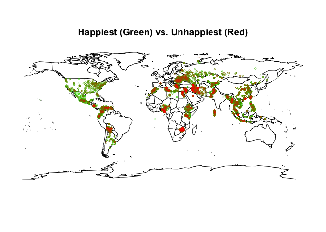
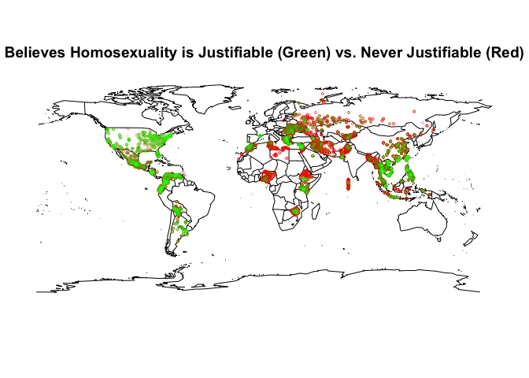
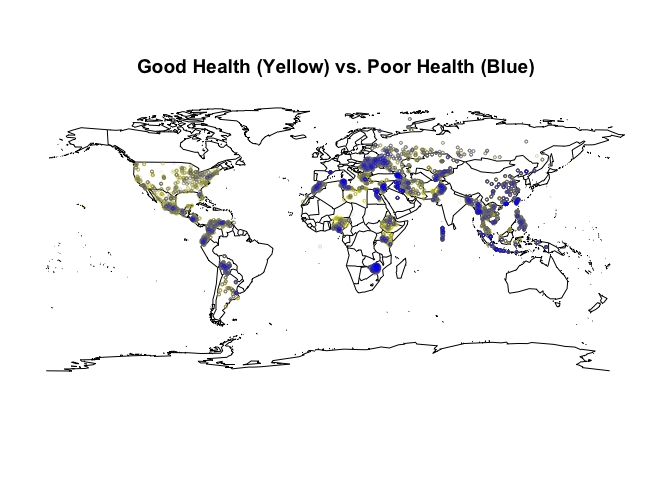
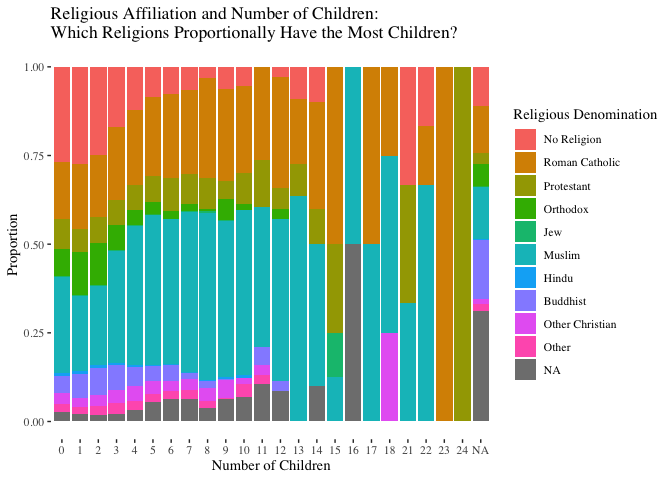
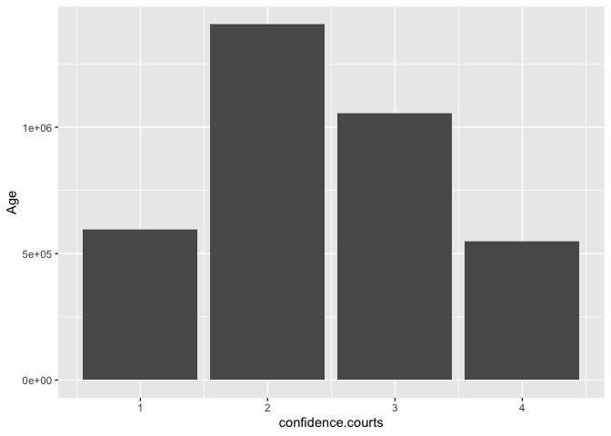
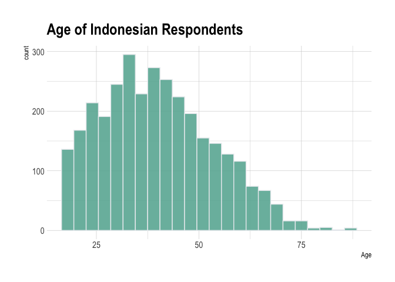
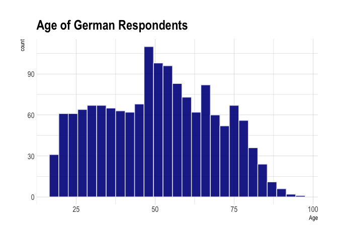
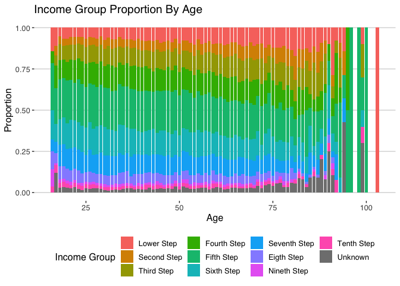

Module 2 Final Project — Milestone 1: EDA
================
Abby Bridgers and Justin Ehringhaus
July 24, 2022

------------------------------------------------------------------------

``` r
library(pacman)
p_load(tidyverse)  # usual suite of packages
p_load(ggthemes)   # extra themes
p_load(hrbrthemes) # more extra themes
p_load(skimr)      # alternative to summary(), skims dataset: skim()
p_load(VIM)        # visualization of missing values: aggr()
p_load(corrplot)   # visualization of a correlation matrix: corrplot()
p_load(maps)       # world map
```

------------------------------------------------------------------------

## Introduction

The World Values Survey (WVS) aims to understand the values, beliefs,
and norms of people all over the world, comparatively and
longitudinally. Operating in more than 120 countries and conducted every
five years, the WVS uses a common questionnaire and household interview
format to investigate human beliefs. The data is made available in
waves, where the most recent Wave 7 represents interviews conducted
between 2017-2022. Time series data including all waves pooled between
1981-2022 is also available.

While examining the pooled dataset would certainly be interesting to
answer questions about the changes worldwide in people’s values,
beliefs, and norms, we are opting to limit the scope of our project to
recent years (Wave 7: 2017-2022). Already, the size and scope of this
dataset represents a big step for our group’s budding data analysts, as
we have never yet worked with anything so faceted. The Wave 7 dataset is
wide, containing 552 variables and 87,822 rows, and thus it will be
necessary to subset those variables that interest us the most.

Our team (Abby Bridgers and Justin Ehringhaus) are interested in how
universal certain values are as well as how values differentiate across
the globe. Abby is hoping to learn specifically about values on
immigration, and Justin is hoping to learn specifically about social
views and ethical values.

##### What did you do with the data in the context of exploration?

We created subsets with our data to explore and analyze from two
perspectives. This allowed us to form separate viewpoints and then pool
our knowledge to better understand the steps necessary to prepare the
data for further analysis.

##### How many entries are in the dataset?

The WVS Wave 7 dataset contains 552 variables and 87,822 rows. We
reduced the number of attributes by about 90%. More details follow.

##### Missing data? Duplicates? Cleanliness? Outliers?

While there was missing data found in our dataset, we elected to refrain
from cleaning the data because doing so may unintentionally falsify the
results of the WVS survey. In a typical data cleaning process, outliers
are removed to concentrate on the central tendency of the data. Missing
data is removed and/or standardized for numerical analysis. Since our
data is ordinal, and we are interested in including and analyzing the
data holistically, we did not feel that it would be appropriate “clean”
the data beyond changing column names, selecting attributes of interest,
and ensuring that there was not a prohibitory amount of NA values found
in our subsets of interest.

------------------------------------------------------------------------

## Data Preparation

``` r
# importing the entire dataset
wvs <- read_csv("../WVS_Cross-National_Wave_7_csv_v4_0.csv")

# checking first few rows and columns for import success
head(wvs)[,1:5]
```

    ## # A tibble: 6 × 5
    ##   version            doi                       A_WAVE A_YEAR A_STUDY
    ##   <chr>              <chr>                      <dbl>  <dbl>   <dbl>
    ## 1 4-0-0 (2022-05-23) doi.org/10.14281/18241.18      7   2019       2
    ## 2 4-0-0 (2022-05-23) doi.org/10.14281/18241.18      7   2019       2
    ## 3 4-0-0 (2022-05-23) doi.org/10.14281/18241.18      7   2019       2
    ## 4 4-0-0 (2022-05-23) doi.org/10.14281/18241.18      7   2019       2
    ## 5 4-0-0 (2022-05-23) doi.org/10.14281/18241.18      7   2019       2
    ## 6 4-0-0 (2022-05-23) doi.org/10.14281/18241.18      7   2019       2

``` r
wvs_subset <- 
  wvs %>% 
  select(
    # --------------------------- DEMOGRAPHICS
    Country = B_COUNTRY_ALPHA,
    Longitude = O1_LONGITUDE,
    Latitude = O2_LATITUDE,
    Settlement.type = H_SETTLEMENT,
    Country.and.year = S025,
    Town.size = G_TOWNSIZE2,
    Age = Q262,
    Income.Group = Q288,
    Ethnic.Group = Q290, # see WVS_codebook.pdf for Q290 coding info
    Immigrant = Q263,
    Religion = Q289,
    Marital.Status = Q273,
    Education = Q275,
    Number.Children = Q274,
    Happiness = Q46,
    Health = Q47,
    # --------------------------- POLITICAL PARTICIPATION / CONFIDENCE IN GOVERNMENT
    votes.locally = Q221,
    votes.nationally = Q222,
    confidence.elections = Q76,
    confidence.courts = Q70,
    confidence.UN = Q83,
    environment.vs.econgrow = Q111,
    # --------------------------- RELATIONSHIP BETWEEN GOVERNMENT AND CITIZENS
    cheating.taxes = Q180,
    gov.video.surveillance = Q196,
    gov.email.monitoring = Q197,
    gov.collecting.info = Q198,
    # --------------------------- ETHICAL VALUES ---------------------------
    terrorism = Q192,
    death.penalty = Q195,
    suicide = Q187,
    beating.wife = Q189,
    beating.children = Q190,
    # --------------------------- SOCIAL VIEWS ---------------------------
    homosexuality = Q182,
    prostitution = Q183,
    abortion = Q184,
    divorce = Q185,
    casual.sex = Q193,
    sex.before.marriage = Q186,
    # --------------------------- CAREER VALUES ---------------------------
    importance.leisure.time = Q3,
    importance.work = Q5,
    # --------------------------- IMMIGRATION ---------------------------
    job.scarc.prioritizes.nonimm = Q34,
    imm.fills.useful.jobs = Q122,
    imm.strengthens.cultural.div = Q123,
    imm.increases.crime.rate = Q124,
    imm.gives.political.asylum = Q125,
    imm.increases.terrorism.risk = Q126,
    imm.helps.poor = Q127,
    imm.increases.unemployment = Q128,
    imm.brings.social.conflict = Q129,
    imm.policy.preference = Q130
    )
```

------------------------------------------------------------------------

## Analysis & Interpretation

``` r
myskim <- skim(wvs_subset)
myskim
```

|                                                  |            |
|:-------------------------------------------------|:-----------|
| Name                                             | wvs_subset |
| Number of rows                                   | 87822      |
| Number of columns                                | 49         |
| \_\_\_\_\_\_\_\_\_\_\_\_\_\_\_\_\_\_\_\_\_\_\_   |            |
| Column type frequency:                           |            |
| character                                        | 1          |
| numeric                                          | 48         |
| \_\_\_\_\_\_\_\_\_\_\_\_\_\_\_\_\_\_\_\_\_\_\_\_ |            |
| Group variables                                  | None       |

Data summary

**Variable type: character**

| skim_variable | n_missing | complete_rate | min | max | empty | n_unique | whitespace |
|:--------------|----------:|--------------:|----:|----:|------:|---------:|-----------:|
| Country       |         0 |             1 |   3 |   3 |     0 |       59 |          0 |

**Variable type: numeric**

| skim_variable                | n_missing | complete_rate |       mean |         sd |        p0 |        p25 |        p50 |        p75 |       p100 | hist  |
|:-----------------------------|----------:|--------------:|-----------:|-----------:|----------:|-----------:|-----------:|-----------:|-----------:|:------|
| Longitude                    |     27098 |          0.69 |      36.16 |      68.09 |   -156.34 |       7.66 |      39.94 |     100.27 |     156.89 | ▁▃▅▇▇ |
| Latitude                     |     27094 |          0.69 |      21.35 |      19.95 |    -43.26 |       6.99 |      24.75 |      35.70 |     100.35 | ▁▅▇▂▁ |
| Settlement.type              |       207 |          1.00 |       3.07 |       1.50 |      1.00 |       2.00 |       3.00 |       5.00 |       5.00 | ▆▆▅▅▇ |
| Country.and.year             |         0 |          1.00 | 4255875.58 | 2465523.95 | 202018.00 | 1702018.00 | 4172020.00 | 6302018.00 | 8622021.00 | ▇▃▇▅▆ |
| Town.size                    |      1274 |          0.99 |       3.15 |       1.45 |      1.00 |       2.00 |       3.00 |       5.00 |       5.00 | ▆▅▆▆▇ |
| Age                          |       339 |          1.00 |      42.85 |      16.36 |     16.00 |      29.00 |      41.00 |      55.00 |     103.00 | ▇▇▆▂▁ |
| Income.Group                 |      2330 |          0.97 |       4.86 |       2.08 |      1.00 |       3.00 |       5.00 |       6.00 |      10.00 | ▃▅▇▃▁ |
| Ethnic.Group                 |      9486 |          0.89 |  416251.81 |  250427.10 |  20001.00 |  158002.00 |  410004.00 |  630001.00 |  862005.00 | ▇▃▇▅▅ |
| Immigrant                    |       344 |          1.00 |       1.06 |       0.24 |      1.00 |       1.00 |       1.00 |       1.00 |       2.00 | ▇▁▁▁▁ |
| Religion                     |      2485 |          0.97 |       3.00 |       2.62 |      0.00 |       1.00 |       3.00 |       5.00 |       9.00 | ▇▃▆▂▁ |
| Marital.Status               |       504 |          0.99 |       2.65 |       2.15 |      1.00 |       1.00 |       1.00 |       5.00 |       6.00 | ▇▁▁▁▃ |
| Education                    |       818 |          0.99 |       3.55 |       2.03 |      0.00 |       2.00 |       3.00 |       5.00 |       8.00 | ▃▇▂▅▂ |
| Number.Children              |      1201 |          0.99 |       1.77 |       1.74 |      0.00 |       0.00 |       2.00 |       3.00 |      24.00 | ▇▁▁▁▁ |
| Happiness                    |       574 |          0.99 |       1.86 |       0.71 |      1.00 |       1.00 |       2.00 |       2.00 |       4.00 | ▅▇▁▂▁ |
| Health                       |       254 |          1.00 |       2.19 |       0.87 |      1.00 |       2.00 |       2.00 |       3.00 |       5.00 | ▃▇▅▁▁ |
| votes.locally                |      4448 |          0.95 |       1.65 |       0.84 |      1.00 |       1.00 |       1.00 |       2.00 |       4.00 | ▇▃▁▂▁ |
| votes.nationally             |      5325 |          0.94 |       1.59 |       0.84 |      1.00 |       1.00 |       1.00 |       2.00 |       4.00 | ▇▃▁▂▁ |
| confidence.elections         |      3604 |          0.96 |       2.63 |       0.95 |      1.00 |       2.00 |       3.00 |       3.00 |       4.00 | ▃▇▁▇▅ |
| confidence.courts            |      3250 |          0.96 |       2.44 |       0.94 |      1.00 |       2.00 |       2.00 |       3.00 |       4.00 | ▃▇▁▆▃ |
| confidence.UN                |     12467 |          0.86 |       2.59 |       0.94 |      1.00 |       2.00 |       3.00 |       3.00 |       4.00 | ▃▇▁▇▅ |
| environment.vs.econgrow      |      3927 |          0.96 |       1.46 |       0.56 |      1.00 |       1.00 |       1.00 |       2.00 |       3.00 | ▇▁▆▁▁ |
| cheating.taxes               |      1134 |          0.99 |       2.22 |       2.14 |      1.00 |       1.00 |       1.00 |       3.00 |      10.00 | ▇▁▁▁▁ |
| gov.video.surveillance       |      3169 |          0.96 |       2.28 |       1.10 |      1.00 |       1.00 |       2.00 |       3.00 |       4.00 | ▇▇▁▅▅ |
| gov.email.monitoring         |      3941 |          0.96 |       2.89 |       1.07 |      1.00 |       2.00 |       3.00 |       4.00 |       4.00 | ▃▅▁▆▇ |
| gov.collecting.info          |      3633 |          0.96 |       2.95 |       1.07 |      1.00 |       2.00 |       3.00 |       4.00 |       4.00 | ▂▃▁▅▇ |
| terrorism                    |      4324 |          0.95 |       1.80 |       1.81 |      1.00 |       1.00 |       1.00 |       2.00 |      10.00 | ▇▁▁▁▁ |
| death.penalty                |      2180 |          0.98 |       4.12 |       3.19 |      1.00 |       1.00 |       3.00 |       7.00 |      10.00 | ▇▂▃▂▂ |
| suicide                      |      2026 |          0.98 |       2.49 |       2.37 |      1.00 |       1.00 |       1.00 |       3.00 |      10.00 | ▇▁▂▁▁ |
| beating.wife                 |       939 |          0.99 |       1.85 |       1.85 |      1.00 |       1.00 |       1.00 |       2.00 |      10.00 | ▇▁▁▁▁ |
| beating.children             |       951 |          0.99 |       2.87 |       2.55 |      1.00 |       1.00 |       1.00 |       5.00 |      10.00 | ▇▂▂▁▁ |
| homosexuality                |      5691 |          0.94 |       3.86 |       3.34 |      1.00 |       1.00 |       2.00 |       6.00 |      10.00 | ▇▂▂▁▂ |
| prostitution                 |      8421 |          0.90 |       2.97 |       2.65 |      1.00 |       1.00 |       1.00 |       5.00 |      10.00 | ▇▂▂▁▁ |
| abortion                     |      1979 |          0.98 |       3.41 |       2.92 |      1.00 |       1.00 |       2.00 |       5.00 |      10.00 | ▇▂▂▁▁ |
| divorce                      |      1729 |          0.98 |       4.90 |       3.17 |      1.00 |       1.00 |       5.00 |       8.00 |      10.00 | ▇▃▆▃▅ |
| casual.sex                   |      7380 |          0.92 |       3.43 |       2.98 |      1.00 |       1.00 |       2.00 |       5.00 |      10.00 | ▇▂▂▁▂ |
| sex.before.marriage          |      4525 |          0.95 |       4.51 |       3.38 |      1.00 |       1.00 |       4.00 |       8.00 |      10.00 | ▇▂▃▂▃ |
| importance.leisure.time      |       473 |          0.99 |       1.79 |       0.78 |      1.00 |       1.00 |       2.00 |       2.00 |       4.00 | ▇▇▁▂▁ |
| importance.work              |      1047 |          0.99 |       1.54 |       0.77 |      1.00 |       1.00 |       1.00 |       2.00 |       4.00 | ▇▃▁▁▁ |
| job.scarc.prioritizes.nonimm |       760 |          0.99 |       2.17 |       1.16 |      1.00 |       1.00 |       2.00 |       3.00 |       5.00 | ▇▇▃▃▁ |
| imm.fills.useful.jobs        |      2411 |          0.97 |       1.18 |       0.86 |      0.00 |       0.00 |       1.00 |       2.00 |       2.00 | ▅▁▃▁▇ |
| imm.strengthens.cultural.div |      2813 |          0.97 |       1.27 |       0.86 |      0.00 |       0.00 |       2.00 |       2.00 |       2.00 | ▃▁▃▁▇ |
| imm.increases.crime.rate     |      2467 |          0.97 |       1.15 |       0.87 |      0.00 |       0.00 |       1.00 |       2.00 |       2.00 | ▆▁▃▁▇ |
| imm.gives.political.asylum   |      7054 |          0.92 |       1.20 |       0.84 |      0.00 |       0.00 |       1.00 |       2.00 |       2.00 | ▅▁▅▁▇ |
| imm.increases.terrorism.risk |      2807 |          0.97 |       1.13 |       0.87 |      0.00 |       0.00 |       1.00 |       2.00 |       2.00 | ▆▁▃▁▇ |
| imm.helps.poor               |      2521 |          0.97 |       1.37 |       0.81 |      0.00 |       1.00 |       2.00 |       2.00 |       2.00 | ▃▁▃▁▇ |
| imm.increases.unemployment   |      2076 |          0.98 |       1.21 |       0.87 |      0.00 |       0.00 |       2.00 |       2.00 |       2.00 | ▅▁▃▁▇ |
| imm.brings.social.conflict   |      2530 |          0.97 |       1.23 |       0.85 |      0.00 |       0.00 |       1.00 |       2.00 |       2.00 | ▅▁▃▁▇ |
| imm.policy.preference        |      5149 |          0.94 |       2.58 |       0.80 |      1.00 |       2.00 |       3.00 |       3.00 |       4.00 | ▂▆▁▇▂ |

The subset of the dataset contains 87822 rows and 49 columns.

Most variables are numeric; only `Country` is classified as a character
vector. `Longitude` and `Latitude` are missing the most data with a
completion rate of 0.6914441, but overall the mean completion rate is
0.9555783, which signifies that missing data is not too much of an issue
for the particular variables under consideration.

As many of the variables are Likert scales, the values are ordinal
ranging from 1 to 5, for example, and thus the descriptive statistics
generated such as mean, sd, quantiles, and histograms give good
indications of the distribution and the characteristics of the data.
However, certain variables such as `Ethnic.Group`, `Country.and.year`,
`Longitude`, and `Latitude` contains nominal, numeric data, and thus the
descriptive statistics generated should be ignored.

``` r
# unique values and associated counts for categorical data only
wvs_subset_categorical <- 
  wvs_subset %>% 
  select(-Longitude,
         -Latitude)

lapply(wvs_subset_categorical, table)
```

    ## $Country
    ## 
    ##  AND  ARG  ARM  AUS  BGD  BOL  BRA  CAN  CHL  CHN  COL  CYP  DEU  ECU  EGY  ETH 
    ## 1004 1003 1223 1813 1200 2067 1762 4018 1000 3036 1520 1000 1528 1200 1200 1230 
    ##  GRC  GTM  HKG  IDN  IRN  IRQ  JOR  JPN  KAZ  KEN  KGZ  KOR  LBN  LBY  MAC  MAR 
    ## 1200 1229 2075 3200 1499 1200 1203 1353 1276 1266 1200 1245 1200 1196 1023 1200 
    ##  MDV  MEX  MMR  MNG  MYS  NGA  NIC  NLD  NZL  PAK  PER  PHL  PRI  ROU  RUS  SGP 
    ## 1039 1741 1200 1638 1313 1237 1200 2145 1057 1995 1400 1200 1127 1257 1810 2012 
    ##  SRB  THA  TJK  TUN  TUR  TWN  UKR  USA  VEN  VNM  ZWE 
    ## 1046 1500 1200 1208 2415 1223 1289 2596 1190 1200 1215 
    ## 
    ## $Settlement.type
    ## 
    ##     1     2     3     4     5 
    ## 18302 17840 14116 14500 22857 
    ## 
    ## $Country.and.year
    ## 
    ##  202018  322017  362018  502018  512021  682017  762018 1042020 1242020 1522018 
    ##    1004    1003    1813    1200    1223    2067    1762    1200    4018    1000 
    ## 1562018 1582019 1702018 1962019 2182018 2312020 2762018 3002017 3202020 3442018 
    ##    3036    1223    1520    1000    1200    1230    1528    1200    1229    2075 
    ## 3602018 3642020 3682018 3922019 3982018 4002018 4042021 4102018 4172020 4222018 
    ##    3200    1499    1200    1353    1276    1203    1266    1245    1200    1200 
    ## 4342022 4462019 4582018 4622021 4842018 4962020 5042021 5282022 5542020 5582020 
    ##    1196    1023    1313    1039    1741    1638    1200    2145    1057    1200 
    ## 5662018 5862018 6042018 6082019 6302018 6422018 6432017 6882017 7022020 7042020 
    ##    1237    1995    1400    1200    1127    1257    1810    1046    2012    1200 
    ## 7162020 7622020 7642018 7882019 7922018 8042020 8182018 8402017 8622021 
    ##    1215    1200    1500    1208    2415    1289    1200    2596    1190 
    ## 
    ## $Town.size
    ## 
    ##     1     2     3     4     5 
    ## 16744 13477 18547 15461 22319 
    ## 
    ## $Age
    ## 
    ##   16   17   18   19   20   21   22   23   24   25   26   27   28   29   30   31 
    ##   28  101 1735 1762 1895 1707 1893 1746 1951 2167 1814 1755 2022 1816 2389 1637 
    ##   32   33   34   35   36   37   38   39   40   41   42   43   44   45   46   47 
    ## 1957 1827 1753 2269 1817 1699 1917 1563 2138 1471 1658 1488 1466 2045 1483 1481 
    ##   48   49   50   51   52   53   54   55   56   57   58   59   60   61   62   63 
    ## 1586 1441 1721 1206 1455 1396 1315 1790 1377 1211 1311 1119 1480 1017 1105 1107 
    ##   64   65   66   67   68   69   70   71   72   73   74   75   76   77   78   79 
    ## 1044 1219  929  841  871  713  843  557  512  478  422  384  352  340  299  260 
    ##   80   81   82   83   84   85   86   87   88   89   90   91   92   93   94   95 
    ##  269  200  219  122  120   99   71   55   44   38   20   28   13   11    7    2 
    ##   96   98   99  100  103 
    ##    1    1   10    1    1 
    ## 
    ## $Income.Group
    ## 
    ##     1     2     3     4     5     6     7     8     9    10 
    ##  6904  5163  9612 11839 20733 13216  9950  4966  1417  1692 
    ## 
    ## $Ethnic.Group
    ## 
    ##  20001  20002  20003  20004  20005  20999  32001  32002  32003  32004  32005 
    ##    951      9      8      5      8     21    705    228     66      1      2 
    ##  32999  36001  36002  36003  36004  36005  36006  36007  36999  50006  50007 
    ##      1   1390    181     52     96     20      8      4     28   1198      1 
    ##  50008  51001  51005  51006  51007  68001  68002  68003  68004  68005  68006 
    ##      1   1209      4      6      3   1018    540    354     36     18      8 
    ##  68007  68008  68999  76001  76002  76003  76004  76005 104001 104002 104003 
    ##      3      8     43    729    247    759     12     13    992     73      2 
    ## 104004 104005 104999 124001 124002 124003 124004 124005 124006 124007 124008 
    ##     38     17     78   3195     81     13     33     51    123     54     44 
    ## 124009 124010 124011 124012 124999 152001 152002 152008 152009 152012 152013 
    ##    211     43     12     14     96    705      6     67      1    136      6 
    ## 152999 156001 158001 158002 158003 158004 158999 170008 170009 170010 170011 
    ##     21   3036    132    967     82     18     23    294      4    135    942 
    ## 170999 196001 196003 196005 218011 218012 218013 218014 218017 218018 231001 
    ##    119    998      1      1     74   1055     54     14      2      1    380 
    ## 231002 231003 231004 231005 231006 231007 231998 231999 300001 300002 300004 
    ##    129    285     81     52     91     82     24    103   1191      2      1 
    ## 300005 320001 320002 320003 320004 320005 320006 344001 344002 344003 344004 
    ##      6     10     31    851     55    251      1   2037      3      2      6 
    ## 344005 344006 344007 344008 344998 344999 360002 360004 360005 360007 360008 
    ##      5      3      2      1     13      3     23   1346    475    157    105 
    ## 360009 360010 360011 360012 360013 360014 360015 360017 360018 360019 360020 
    ##     60     75      5     82      1     68     17     12     76     61      9 
    ## 360021 360022 360023 360024 360026 360999 364001 364002 364003 364004 364005 
    ##     20     38     16     66      7    476    730    341    102     97    127 
    ## 364006 364007 364999 368001 368002 368003 368004 398001 398002 398003 398004 
    ##     26     23     40   1006    176     16      2     14      9      1      1 
    ## 398005 398021 398022 398023 398024 398025 398026 398027 398028 398029 398030 
    ##      1     11      1      1      7    851     21      1      2    276      2 
    ## 398031 398032 398033 398040 404001 404002 404003 404004 404005 404006 404007 
    ##     12      7     52      6    152    128    232     68    189    150     26 
    ## 404008 404009 404010 404011 404014 404016 410004 417001 417002 417003 417004 
    ##     72     68     90     33      2     56   1232    891    138    117      3 
    ## 417005 417999 434005 434006 434007 434008 434999 446001 446003 446004 446006 
    ##      6     42   1142     40      8      3      3      1      1      2    996 
    ## 446007 446008 446999 458004 458012 458014 462001 462003 462004 484001 484002 
    ##      6     13      3    884    327    102      9   1029      1    405    997 
    ## 484003 484004 484005 496001 496002 496003 496004 496005 496006 496007 496008 
    ##    315      1     16   1327     90     41     44     12      7      8      4 
    ## 496009 496011 496012 496014 496015 496016 496017 504005 528001 528002 528003 
    ##      1     47      1      4      9     41      2   1200   1562     32     33 
    ## 528004 528005 528999 558001 558002 558003 558999 566001 566002 566003 566004 
    ##     35     22    137   1123     27      9     41    312    381    188     17 
    ## 566005 566006 566998 566999 586001 586003 586004 586005 586006 586007 586008 
    ##     25      8      1    305    915     60    324     28    280    133    228 
    ## 586009 586999 604001 604012 604013 604014 604015 604016 604998 604999 608001 
    ##      2     25     60    104   1037     49     29     94      3     23    362 
    ## 608002 608003 608004 608005 608006 608007 608010 608015 608017 608018 608020 
    ##      1    142     52     89     63      3     22      2     10      1     10 
    ## 608024 608026 608027 608028 608031 608032 608039 608047 608048 608049 608050 
    ##    329      1      5      3     16      1     22      2     10      1      1 
    ## 608051 608052 608053 608054 608055 608056 608057 608058 608059 608060 608061 
    ##      8      2      1      5      1      3      1      2      4      4      1 
    ## 608062 630001 630002 630007 630012 630013 630999 642005 642999 643001 643002 
    ##     20    493     38      9    409    146     23   1251      6   1554     85 
    ## 643003 643005 643007 643015 643016 643020 643023 643035 643036 643037 643040 
    ##      6      1      1      1      7      3      1      4      5     12      5 
    ## 643053 643080 643097 643999 688001 688999 702001 702003 702004 702006 702008 
    ##      1      3     43     63   1036     10      6    190   1549    236     10 
    ## 702999 704001 704002 704007 704009 716001 716002 716006 716007 716008 716999 
    ##     21   1158      9     30      3      8      2   1000    166      1     38 
    ## 762001 762002 762004 764001 764002 764003 764004 764999 788002 788003 788005 
    ##   1080    118      2   1425      3     60      7      5      6      6   1185 
    ## 788999 804001 804002 804003 804004 804005 804999 818001 818004 818006 818999 
    ##      1   1212     48      4      2      1      8   1032      5     73     19 
    ## 840001 840002 840003 840004 840005 862001 862002 862003 862004 862005 
    ##   1725    210    123    453     85    423    385    319     52     11 
    ## 
    ## $Immigrant
    ## 
    ##     1     2 
    ## 82299  5179 
    ## 
    ## $Religion
    ## 
    ##     0     1     2     3     4     5     6     7     8     9 
    ## 19919 16027  6508  7762   235 23807   569  5556  2777  2177 
    ## 
    ## $Marital.Status
    ## 
    ##     1     2     3     4     5     6 
    ## 49193  6782  3614  1909  4770 21050 
    ## 
    ## $Education
    ## 
    ##     0     1     2     3     4     5     6     7     8 
    ##  4690 10721 12179 22178  8235  7446 15158  5402   995 
    ## 
    ## $Number.Children
    ## 
    ##     0     1     2     3     4     5     6     7     8     9    10    11    12 
    ## 25784 15139 22558 11839  5700  2676  1409   641   417   223   114    38    35 
    ##    13    14    15    16    17    18    21    22    23    24 
    ##    11    10     8     2     2     4     3     6     1     1 
    ## 
    ## $Happiness
    ## 
    ##     1     2     3     4 
    ## 27071 47564 10659  1954 
    ## 
    ## $Health
    ## 
    ##     1     2     3     4     5 
    ## 19021 38932 24210  4434   971 
    ## 
    ## $votes.locally
    ## 
    ##     1     2     3     4 
    ## 46809 20599 13987  1979 
    ## 
    ## $votes.nationally
    ## 
    ##     1     2     3     4 
    ## 50922 17359 11616  2600 
    ## 
    ## $confidence.elections
    ## 
    ##     1     2     3     4 
    ## 10156 28353 27975 17734 
    ## 
    ## $confidence.courts
    ## 
    ##     1     2     3     4 
    ## 13937 32406 25074 13155 
    ## 
    ## $confidence.UN
    ## 
    ##     1     2     3     4 
    ##  9319 26878 24348 14810 
    ## 
    ## $environment.vs.econgrow
    ## 
    ##     1     2     3 
    ## 47702 33650  2543 
    ## 
    ## $cheating.taxes
    ## 
    ##     1     2     3     4     5     6     7     8     9    10 
    ## 54747  9203  6331  3610  4960  2282  1680  1251   643  1981 
    ## 
    ## $gov.video.surveillance
    ## 
    ##     1     2     3     4 
    ## 25402 27442 14680 17129 
    ## 
    ## $gov.email.monitoring
    ## 
    ##     1     2     3     4 
    ## 11680 17864 22434 31903 
    ## 
    ## $gov.collecting.info
    ## 
    ##     1     2     3     4 
    ## 11546 16165 21499 34979 
    ## 
    ## $terrorism
    ## 
    ##     1     2     3     4     5     6     7     8     9    10 
    ## 62512  6601  3911  2322  3509  1410   903   707   425  1198 
    ## 
    ## $death.penalty
    ## 
    ##     1     2     3     4     5     6     7     8     9    10 
    ## 32338  6125  5342  4087 10530  5471  4755  5096  2811  9087 
    ## 
    ## $suicide
    ## 
    ##     1     2     3     4     5     6     7     8     9    10 
    ## 51707  7436  5559  3435  7521  3045  2003  1716   809  2565 
    ## 
    ## $beating.wife
    ## 
    ##     1     2     3     4     5     6     7     8     9    10 
    ## 64176  6875  4282  2535  3799  1645  1006   747   453  1365 
    ## 
    ## $beating.children
    ## 
    ##     1     2     3     4     5     6     7     8     9    10 
    ## 45048  8236  6615  4699  8777  3972  2687  2500  1073  3264 
    ## 
    ## $homosexuality
    ## 
    ##     1     2     3     4     5     6     7     8     9    10 
    ## 37570  4967  4037  3211  9115  3866  2893  3366  2090 11016 
    ## 
    ## $prostitution
    ## 
    ##     1     2     3     4     5     6     7     8     9    10 
    ## 41253  6646  5374  3851  8874  3685  2760  2444  1097  3417 
    ## 
    ## $abortion
    ## 
    ##     1     2     3     4     5     6     7     8     9    10 
    ## 39931  6502  5802  4207 10290  4357  3450  3748  2019  5537 
    ## 
    ## $divorce
    ## 
    ##     1     2     3     4     5     6     7     8     9    10 
    ## 22571  4768  4911  4651 14786  6818  5957  6392  3517 11722 
    ## 
    ## $casual.sex
    ## 
    ##     1     2     3     4     5     6     7     8     9    10 
    ## 37828  6195  5113  3951  9085  3977  3055  3436  1810  5992 
    ## 
    ## $sex.before.marriage
    ## 
    ##     1     2     3     4     5     6     7     8     9    10 
    ## 29389  5143  4190  3655 10886  5064  4125  5136  3105 12604 
    ## 
    ## $importance.leisure.time
    ## 
    ##     1     2     3     4 
    ## 35509 37328 12046  2466 
    ## 
    ## $importance.work
    ## 
    ##     1     2     3     4 
    ## 51776 25846  6186  2967 
    ## 
    ## $job.scarc.prioritizes.nonimm
    ## 
    ##     1     2     3     4     5 
    ## 29832 31468 10934 10724  4104 
    ## 
    ## $imm.fills.useful.jobs
    ## 
    ##     0     1     2 
    ## 25313 19418 40680 
    ## 
    ## $imm.strengthens.cultural.div
    ## 
    ##     0     1     2 
    ## 22722 16673 45614 
    ## 
    ## $imm.increases.crime.rate
    ## 
    ##     0     1     2 
    ## 26507 19537 39311 
    ## 
    ## $imm.gives.political.asylum
    ## 
    ##     0     1     2 
    ## 22358 20201 38209 
    ## 
    ## $imm.increases.terrorism.risk
    ## 
    ##     0     1     2 
    ## 27340 18920 38755 
    ## 
    ## $imm.helps.poor
    ## 
    ##     0     1     2 
    ## 18130 17626 49545 
    ## 
    ## $imm.increases.unemployment
    ## 
    ##     0     1     2 
    ## 25114 17702 42930 
    ## 
    ## $imm.brings.social.conflict
    ## 
    ##     0     1     2 
    ## 23303 19377 42612 
    ## 
    ## $imm.policy.preference
    ## 
    ##     1     2     3     4 
    ##  8174 26776 39370  8353

The unique values and associated counts of the categorical data above
reveals the dataset is clean. Thankfully, data collection and data entry
efforts conducted by the World Values Survey appear to be rigorous, and
thus there do not appear to be instances of inappropriately assigned
values.

That said, one question for consideration is whether to consider
abnormal or atypical experiences as outlier information. For example, if
we examine the `Number.Children` variable, we can see the minimum value
is 0 and the maximum value is 24. Clearly, that is a high maximum, but
if we assume the value was not entered incorrectly, then this is an
actual facet of the human experience and should not be treated as an
outlier. Removing such data points from our analysis would, in fact,
skew our perception of the human experience, and thus for this
particular dataset we will opt not to remove any pieces of information
with the assumption that data has rigorously been collected and verified
by research professionals.

``` r
# ordinal, numeric data only 
wvs_subset_ordinal <- 
  wvs_subset %>% 
  select(-Longitude,
         -Latitude,
         -Country, 
         -Ethnic.Group, 
         -Country.and.year,
         -Religion)

# assessing correlations between ordinal, numeric data
# only including data where pairwise observations are complete (i.e., not including missing data)
cor <- cor(wvs_subset_ordinal, use = "pairwise.complete.obs")
corrplot(cor, 
         method = "circle", 
         insig = "blank", 
         diag = FALSE,
         tl.cex = 0.5) %>% 
    corrRect(name = c('Settlement.type', 
                      'votes.locally', 
                      'cheating.taxes', 
                      'terrorism', 
                      'homosexuality',
                      'importance.leisure.time',
                      'job.scarc.prioritizes.nonimm',
                      'imm.policy.preference'))
```

<!-- -->

The visualization of a correlation matrix above indicates the extent to
which each variable, compared to one another, correlates or relates.
Darker blue colors represent stronger positive correlations, and darker
orange colors represent stronger negative correlations. For
visualization purposes, we have bucketed the variables into four groups,
albeit it must be noted that by doing so we risk imposing structure
where it does not, or should not, exist:

-   The first bucket contains variables relating to demographics
-   The second relates to political participation / confidence in
    government
-   The third relates to the relationship between government and
    citizens
-   The fourth relates to ethical values
-   The fifth relates to social views
-   The sixth relates to career values
-   The seventh relates to immigration

There are endless conversations that could be held based off this
visualization of a correlation matrix. Some key insights are as follows:

-   All variables in the fifth bucket (social views) are strongly
    correlated. This makes sense, as those with similar social views are
    generally split along the lines of liberal versus conservative
    thought. For example, it makes sense that those who hold
    conservative views on sexuality also hold conservative views on
    marriage, career, and government.
-   Education is positively correlated with liberal social views (i.e.,
    higher education = more liberal social views).
-   Number of children is negatively correlated with liberal social
    views (i.e., more children = more conservative social views).
-   Education is negatively correlated with number of children (i.e.,
    higher education = less children).
-   Voting locally or nationally is negatively correlated with age
    (i.e., older people participate more in politics).
-   Views on terrorism positively correlate with views on domestic abuse
    (i.e., those who view terrorism favorably also view domestic abuse
    favorably).
-   There is a moderate correlation between two questions on
    immigration. In the immigration questions, respondents were asked to
    answered their degree of agreement with statements. The moderately
    positively correlated statements are “Immigration in my country
    increases crime rate” and “immigration in my country brings social
    conflict.” These questions are answered on the same ordinal scale of
    3 options: “disagree”, “hard to say”, and “agree”.
-   There is a strong negative correlation between settlement type and
    town size which are both on a 5-point scale. A response of “1” to
    the town size question means the respondent lives in a town of under
    5,000 people. A response of “1” to the settlement type question
    means the respondent lives in the capital city of their country.
    Therefore, there is a strong inverse relationship between these two
    attributes.

The above observations from the correlation matrix are just several of
many possible avenues for exploration. By understanding how different
variables correlate, we can begin to explore specific facets of the
dataset in more detail.

``` r
# Creates colored points (gradient) based on particular categorical numeric values in dataframe.
# For display in a map (see examples below)
map_color_range <- function(tibl, col, 
                            min_color = "green", max_color = "red",
                            shape = 1, size = 0.4) {
  min_value <- min(col, na.rm = TRUE)
  max_value <- max(col, na.rm = TRUE)
  # vector of color gradients with a length of `max_value`
  colors <- colorRampPalette(c(min_color, max_color))(max_value)
  # executes points() for each value between min and max
  for (i in min_value:max_value) {
    tibl_subset_col <- 
      tibl %>% 
      filter(col == i) 
    points(tibl_subset_col$Longitude, 
           tibl_subset_col$Latitude, 
           col = alpha(colors[i], 0.1), # colors from color ramp above w/ transparency
           pch = shape, 
           cex = size)
  }
}

map("world")
title(main = "Happiest (Green) vs. Unhappiest (Red)")
map_color_range(wvs_subset, wvs_subset$Happiness)
```

<!-- -->

Another way of exploring the data is to investigate geospatial
relationships using longitude and latitude data paired with variables of
interest. For example, the visualization above reveals respondents
happiness levels from “very happy” (greener points) to “not at all
happy” (redder points). Pockets of unhappiness appear clustered in South
America, parts of Africa, and parts of Europe and Asia. Generally, the
United States and Mexico appear happier.

Geospatial data can reveal many interesting trends. As another example,
we can visualize beliefs on homosexuality, where greener colors
represent those who believe homosexuality is “always justifiable” and
redder colors represent those who believe homosexuality is “never
justifiable.” Eastern Europe and parts of Africa appear most opposed to
homosexuality.

``` r
map("world")
title(main = "Believes Homosexuality is Justifiable (Green) vs. Never Justifiable (Red)")
map_color_range(wvs_subset, wvs_subset$homosexuality, 
                min_color = "red", max_color = "green")
```

<!-- -->

The relationship between geography and health looks remarkably similar
to that of geography and happiness. As is the case with happiness, the
US and Mexico appear most healthy, with strong clusters of poor health
in Africa, South America, and Europe, to name a few. Southeast Asia
appears to be one of the most diverse areas in terms of health, with a
great deal of both blue and yellow shown on the map.

``` r
map("world")
title(main = "Good Health (Yellow) vs. Poor Health (Blue)")
map_color_range(wvs_subset, wvs_subset$Health, 
                min_color = "yellow", max_color = "blue")
```

<!-- -->

As we could not include the `Religion` variable in our correlation
matrix above as it is a nominal rather than ordinal variable, it will be
interesting to explore religion in relation to `Number.Children`, for
example. The visualization below reveals some interesting trends in
religious affiliation and family size:

-   Muslims tends to have the most children proportionally and in the
    highest numbers.
-   Those without a religion generally have fewer children.
-   Only Roman Catholics and Protestants have 23+ children, which
    signifies there may be only one instance (one individual) accounting
    for this particular data. As discussed previously, we will not
    consider this an outlier as this is a fact of the human experience.
    Removing such data would skew our perception of what occurs in the
    world.

``` r
Religion.names <- c('No Religion', 'Roman Catholic', 'Protestant', 'Orthodox',
                    'Jew', 'Muslim', 'Hindu', 'Buddhist', 'Other Christian', 'Other', 'NA')

wvs_subset %>% 
  ggplot +
  aes(x = factor(Number.Children), fill = factor(Religion)) +
  geom_bar(position = "fill") +
  scale_fill_discrete(name = "Religious Denomination",
                      labels = Religion.names) +
  xlab("Number of Children") +
  ylab("Proportion") +
  ggtitle("Religious Affiliation and Number of Children:\nWhich Religions Proportionally Have the Most Children?") +
  theme_tufte()
```

<!-- -->

``` r
# basic bar chart
ggplot(wvs_subset, aes(x=confidence.courts, y=Age)) + 
  geom_bar(stat = "identity")
```

    ## Warning: Removed 3574 rows containing missing values (position_stack).

<!-- -->

In the above barchart, confidence in the courts is measured. Confidence
ranges from “A great deal” (1) to “Not at all” (4). Most respondents
chose 2, meaning they have “Quite a lot” of confidence in the courts.

``` r
# histogram of age of Indonesian respondents 
p <- wvs_subset %>%
  filter( Country=="IDN" ) %>%
  ggplot( aes(x=Age)) +
    geom_histogram( binwidth=3, fill="#69b3a2", color="#e9ecef", alpha=0.9) +
    ggtitle("Age of Indonesian Respondents") +
    theme_ipsum() +
    theme(
      plot.title = element_text(size=20)
    )
p 
```

<!-- -->

In the above histogram, the age of Indonesian respondents is shown. Very
few respondents are over the age of 75. The data is clustered around age
30, with the majority of respondents being between ages 25 and 50. The
average age in Indonesia is around 30, which aligns with the average age
worldwide. Conversely, Germany has a high average age of 48. In the
following histogram, I find the age of German respondents to see if the
data is clustered around a higher average age than 30 given the much
higher country average.

``` r
# histogram of age of German respondents 
p <- wvs_subset %>%
  filter( Country=="DEU" ) %>%
  ggplot( aes(x=Age)) +
    geom_histogram( binwidth=3, fill="blue4", color="#e9ecef", alpha=0.9) +
    ggtitle("Age of German Respondents") +
    theme_ipsum() +
    theme(
      plot.title = element_text(size=20)
    )
p 
```

<!-- -->

As expected, the above histogram shows that the average age of German
respondents is closer to 50. There may be a difference in viewpoints
among those age 30 and 50, making age an important factor for continued
consideration in our project.

``` r
# age overlaid with income in prop bar chart
Income.details <- c('Lower Step', 'Second Step', 'Third Step', 'Fourth Step', 'Fifth Step', 'Sixth Step', 'Seventh Step', 'Eigth Step', 'Nineth Step', 'Tenth Step', 'Unknown', 'No Answer', 'Not Asked', 'NA')

wvs_subset %>% 
  ggplot +
  aes(x = Age, fill = factor(Income.Group)) +
  geom_bar(position = "fill") +
  scale_fill_discrete(name = "Income Group",
                      labels = Income.details) +
  xlab("Age") +
  ylab("Proportion") +
  ggtitle("Income Group Proportion By Age") +
  theme_hc()
```

    ## Warning: Removed 339 rows containing non-finite values (stat_count).

<!-- -->

The above proportional stacked bar graph allows for visualizing
differences in income by age. Respondents were shown cards with their
country’s income broken down into ten buckets. Since this varies heavily
by country, the Wave 7 results do not include any specific numbers.
Instead, income is purely comparative. In this chart, several middle
income groups appear to fall with increasing age; third through sixth
steps noticably decrease from young respondents through middle age
respondents to elderly respondents. The highest income, tenth step,
appears relatively constant across ages, with a noticable increase in
variance from age to age among those in and beyond their 80s. The most
common income group appears to be the fifth step, which may mean that
most people consider themselves middle-class in the context of their
home country.

## Conclusions

##### What did you find? What intrigued you about the data? Why does that matter?

-   We were impressed by the cleanliness of the dataset after completing
    initial exploratory analysis.
-   We found several correlations, including social, family,
    immigration, and demographic information.
-   For instance, we found some interesting insights around education.
    Education is positively correlated with liberal social views,
    meaning that respondents with post-secondary degrees have more
    liberal social views. Education is negatively correlated with
    quantity of children, meaning that respondents with post-secondary
    degrees have fewer children.
-   To offer a second example, we found moderate correlations with
    several immigration variables. Respondents with negative views
    towards immigration tend to feel negatively across variables.
-   We found interesting patterns by looking at the scale of a variable
    on a map of the world. For instance, happiness appeared highly
    variable by geography. for instance, Russia, the US, Mexico,
    Argentina, and the Philippines all appear very green, indicating
    high rates of happiness in those countries. In contrast, Zimbabwe,
    Egypt, Iran, Bolivia, and certain parts of China are very red,
    indicating high rates of unhappiness in those countries.
-   In addition, we explored religious affiliation and number of
    children using a proportional bar chart. We found that the
    respondent with 24 children is Protestant. In addition, from this
    chart, we were able to see the religious makeup of respondents; the
    plurality of respondents are Hindus.
-   We also explored income group proportion by age, finding that the
    highest income group was fairly equally represented across ages,
    while other income groups, such as the lowest step and the
    third-lowest step, increased in proportion with age.

These preliminary findings matter because they shed light on differences
in identity, which can be contrasted to social, political, and ethical
viewpoints to deduce relationships between identity and belief.

##### What would your proposed next steps be?

-   Share learning and techniques with classmates.
-   Integrate feedback from Professor Hodeghatta to improve our analysis
    and streamline our path forward.
-   Uncover answers to our key questions by applying data mining
    techniques including decision trees, clusters, association mining,
    and linear discriminant analysis.
-   Continue to write about our findings and comment throughout the
    code.

##### What business questions do you plan to answer with your data mining?

-   Predicting the happiness and health of an individual.
-   Predicting the religious affiliation of an individual.
-   Predicting the immigration views, social views, and ethical values
    of an individual.
-   The relationship between income (Q288), happiness (Q46), and health
    (Q47).
-   The relationship between marital status (Q273) and political
    engagement (Q209 - Q222).
-   The relationship between religious denomination (Q289) and number of
    children (Q274).
-   The differences in ethical values (Q177-Q195) by ethnic group
    (Q290).
-   The relationship between immigration stance (122:130) and age (262).
-   The relationship between education completed (Q275) and the
    importance of leisure time (Q3).

## Works Cited

<div id="refs" class="references csl-bib-body hanging-indent">

<div id="ref-wvs" class="csl-entry">

Haerpfer, Inglehart, C. n.d. “World Values Survey: Round Seven -
Country-Pooled Datafile Version 4.0.”
<http://dx.doi.org/10.14281/18241.18>.
<https://doi.org/10.14281/18241.18>.

</div>

<div id="ref-R-Replace-Matching" class="csl-entry">

Taiyun Wei, Viliam Simko. 2021. “An Introduction to Corrplot Package.”
<https://cran.r-project.org/web/packages/corrplot/vignettes/corrplot-intro.html>.

</div>

</div>
